# SpringCloud


## 简介

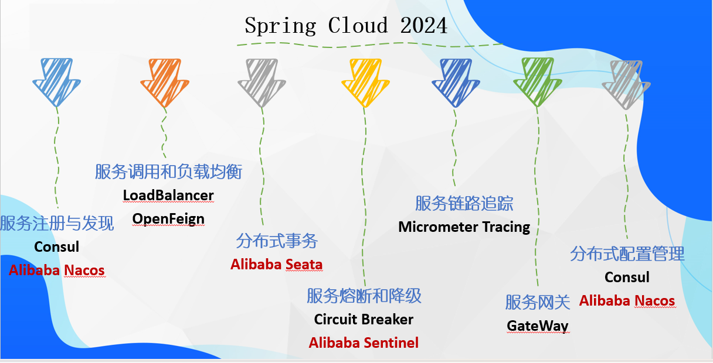


## 一、Mybatis一键生成

1. [Mapper4](https://github.com/abel533/Mapper)
2. [generator](https://mybatis.org/generator/)


## 二、Consul服务注册与发现


 ### 是什么？ 

[Consul](https://www.consul.io/) 是一套开源的**分布式服务发现和配置管理系统** ，提供了微服务系统中的服务治理、配置中心、控制总线等功能。


### 能干嘛？

1. 服务发现

2. 健康检测
3. KV存储
4. 多数据中心
5. 可视化Web界面


### 安装并运行

1. 使用开发者模式启动

   ```shell
   consul agent -dev
   ```

2. 访问`localhost:8500`进入web控制台


### 项目配置

#### 引入pom

```xml
<!--SpringCloud consul discovery -->
<dependency>
	<groupId>org.springframework.cloud</groupId>
	<artifactId>spring-cloud-starter-consul-discovery</artifactId>
</dependency>
<!--SpringCloud consul config-->
<dependency>
    <groupId>org.springframework.cloud</groupId>
    <artifactId>spring-cloud-starter-consul-config</artifactId>
</dependency>
<dependency>
    <groupId>org.springframework.cloud</groupId>
    <artifactId>spring-cloud-starter-bootstrap</artifactId>
</dependency>
```

#### 代码配置

1. 注册与发现

- 主启动类上需要标注`@EnableDiscoveryClient`开启服务发现

- application.yml

```yaml
 spring:
  application:
    name: cloud-payment-service

  ####Spring Cloud Consul for Service Discovery
  cloud:
    consul:
      host: localhost
      port: 8500
      discovery:
        service-name: ${spring.application.name}
      profile:
      	activce:dev # 多环境配置加载内容dev/prod,不写就是默认default配置
```

2. 动态刷新

- 若要开启`动态配置刷新`，需在主启动类上标注`@RefreshScope`开启*动态刷新*

- bootstrap.yml

```yaml
spring:
  application:
    name: cloud-payment-service
    ####Spring Cloud Consul for Service Discovery
  cloud:
    consul:
      host: localhost
      port: 8500
      discovery:
        service-name: ${spring.application.name}
      config:
        profile-separator: '-' 	# 默认分隔符是 ","，修改为 '-'
        format: YAML
```

- controller 案例

```java
@GetMapping(value = "/pay/get/info")
private String getInfoByConsul(@Value("${atguigu.info}") String atguiguInfo)
{
    return "atguiguInfo: "+atguiguInfo;
}
```

### Consul数据持久化配置

- **mac**

1. 新建`mybata`文件夹
2. 启动命令

```shell
consul agent -server -ui -bind=127.0.0.1 -client=0.0.0.0 -bootstrap-expect 1 -data-dir=/opt/homebrew/Cellar/consul/mydata
```

- **Windows**

1. 新建`mybata`文件夹
2. 新建`consul_start.bat`文件

```shell
@echo.服务启动......  
@echo off  
@sc create Consul binpath= "D:\devSoft\consul_1.17.0_windows_386\consul.exe agent -server -ui -bind=127.0.0.1 -client=0.0.0.0 -bootstrap-expect  1  -data-dir D:\devSoft\consul_1.17.0_windows_386\mydata   "
@net start Consul
@sc config Consul start= AUTO  
@echo.Consul start is OK......success
@pause
```

3. 以管理员身份运行

### RestTemplate（不推荐使用）

1. **RestTemplate**是一个执行`HTTP`请求的同步阻塞式工具类，它仅仅只是在 `HTTP` 客户端库（例如 `JDK HttpURLConnection`，`Apache HttpComponents`，`okHttp` 等）基础上，封装了更加简单易用的模板方法 API，方便程序员利用已提供的模板方法发起网络请求和处理，能很大程度上提升我们的开发效率。**RestTemplate** 是从 Spring3.0 开始支持的一个 HTTP 请求工具，它提供了常见的REST请求方案的模版，例如 GET 请求、POST 请求、PUT 请求、DELETE 请求以及一些通用的请求执行方法 exchange 以及execute。
2. 配置使用

```java
@Configuration
public class RestTemplateConfig
{
    @Bean
    @LoadBalanced //开启负载均衡
    public RestTemplate restTemplate()
    {
        return new RestTemplate();
    }
}
```


### ** CAP

1. C：Consistency（强一致性）
2. A：Avalilability（可用性）
3. P：Partition tolerance（分区容错性）


#### AP架构

1. 当网络分区出现后，为了保证可用性，系统B可以**返回旧值**，保证系统的可用性。

2. 当数据出现不一致时，虽然A, B上的注册信息不完全相同，但每个Eureka节点依然能够正常对外提供服务，这会出现查询服务信息时如果请求A查不到，但请求B就能查到。如此保证了可用性但牺牲了一致性
3. 结论：**违背了一致性C的要求，只满足可用性和分区容错，即AP**

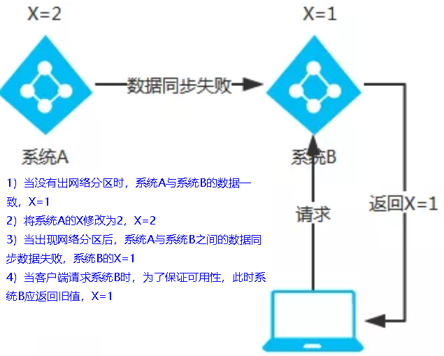

#### CP架构

1. 当网络分区出现后，为了保证一致性，**就必须拒接请求**，否则无法保证一致性。
2. `Consul` 遵循CAP原理中的CP原则，保证了强一致性和分区容错性，且使用的是`Raft`算法，比zookeeper使用的Paxos算法更加简单。
3. 虽然保证了强一致性，但是可用性就相应下降了，例如服务注册的时间会稍长一些，因为 Consul 的 raft 协议要求必须过半数的节点都写入成功才认为注册成功 ；在leader挂掉了之后，重新选举出leader之前会导致Consul 服务不可用。
4. 结论：**违背了可用性A的要求，只满足一致性和分区容错，即CP**

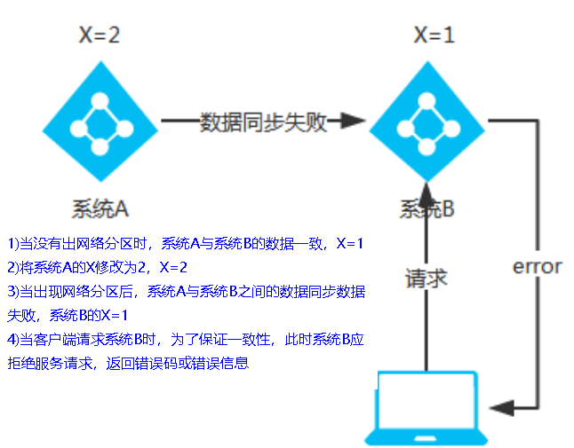


## 三、LoadBanlancer负载均衡服务调用


### 是什么？

#### LB负载均衡(Load Balance)是什么

简单的说就是将用户的请求平摊的分配到多个服务上，从而达到系统的HA（高可用），常见的负载均衡有软件Nginx，LVS，硬件 F5等

#### spring-cloud-starter-loadbalancer组件是什么

[Spring Cloud LoadBalancer](https://docs.spring.io/spring-cloud-commons/reference/spring-cloud-commons/loadbalancer.html)是由SpringCloud官方提供的一个开源的、简单易用的**客户端负载均衡器**，它包含在SpringCloud-commons中*用它来替换了以前的Ribbon组件*。相比较于Ribbon，SpringCloud LoadBalancer不仅能够支持RestTemplate，还支持WebClient（WeClient是Spring Web Flux中提供的功能，可以实现响应式异步请求）


### 能干嘛？

#### LoadBalancer 在工作时分成两步：

1. 第一步，先选择ConsulServer从服务端查询并拉取服务列表，知道了它有多个服务(上图3个服务)，这3个实现是完全一样的，默认轮询调用谁都可以正常执行。类似生活中求医挂号，某个科室今日出诊的全部医生，客户端你自己选一个。
2. 第二步，按照指定的负载均衡策略从server取到的服务注册列表中由客户端自己选择一个地址，所以LoadBalancer是一个**客户端的**负载均衡器。

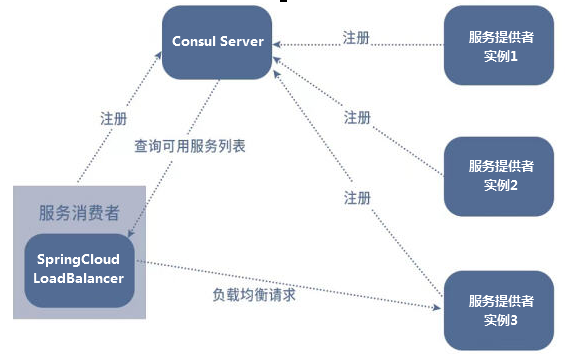


### 项目配置

#### 引入pom

```xml
<!--loadbalancer-->
<dependency>
    <groupId>org.springframework.cloud</groupId>
    <artifactId>spring-cloud-starter-loadbalancer</artifactId>
</dependency>
```

#### 标记注解

在[RestTemplate](#RestTemplate（不推荐使用）)配置类上注解`@LoadBalanced`


### ** 负载均衡算法

1. **轮询法**

   将请求按顺序轮流地分配到后端服务器上，它均衡地对待后端的每一台服务器，而不关心服务器实际的连接数和当前的系统负载。

2. **随机法**

   通过系统的随机算法，根据后端服务器的列表大小值来随机选取其中的一台服务器进行访问。由概率统计理论可以得知，随着客户端调用服务端的次数增多，其实际效果越来越接近于平均分配调用量到后端的每一台服务器，也就是轮询的结果。

```java
@Configuration
@LoadBalancerClient(
        //下面的value值大小写一定要和consul里面的名字一样，必须一样
        value = "cloud-payment-service",configuration = RestTemplateConfig.class)
public class RestTemplateConfig
{
    @Bean
    @LoadBalanced //使用@LoadBalanced注解赋予RestTemplate负载均衡的能力
    public RestTemplate restTemplate(){
        return new RestTemplate();
    }

    @Bean
    ReactorLoadBalancer<ServiceInstance> randomLoadBalancer(Environment environment,
                                                            LoadBalancerClientFactory loadBalancerClientFactory) {
        String name = environment.getProperty(LoadBalancerClientFactory.PROPERTY_NAME);

        return new RandomLoadBalancer(loadBalancerClientFactory.getLazyProvider(name, ServiceInstanceListSupplier.class), name);
    }
}
```

3. **源地址哈希法**

   源地址哈希的思想是根据获取客户端的IP地址，通过哈希函数计算得到的一个数值，用该数值对服务器列表的大小进行取模运算，得到的结果便是客服端要访问服务器的序号。采用源地址哈希法进行负载均衡，同一IP地址的客户端，当后端服务器列表不变时，它每次都会映射到同一台后端服务器进行访问。

4. **加权轮询法**

   不同的后端服务器可能机器的配置和当前系统的负载并不相同，因此它们的抗压能力也不相同。给配置高、负载低的机器配置更高的权重，让其处理更多的请；而配置低、负载高的机器，给其分配较低的权重，降低其系统负载，加权轮询能很好地处理这一问题，并将请求顺序且按照权重分配到后端。

5. **加权随机法**

   与加权轮询法一样，加权随机法也根据后端机器的配置，系统的负载分配不同的权重。不同的是，它是按照权重随机请求后端服务器，而非顺序。

6. **最小连接数法**

   最小连接数算法比较灵活和智能，由于后端服务器的配置不尽相同，对于请求的处理有快有慢，它是根据后端服务器当前的连接情况，动态地选取其中当前

   积压连接数最少的一台服务器来处理当前的请求，尽可能地提高后端服务的利用效率，将负责合理地分流到每一台服务器。


## 四、OpenFeign服务接口有与调用


### 是什么？

[Feign](https://docs.spring.io/spring-cloud-openfeign/docs/current/reference/html/#spring-cloud-feign)是一个**声明性web服务客户端**。**使用Feign创建一个接口并对其进行注释。**它具有可插入的注释支持，包括Feign注释和JAX-RS注释。Feign还支持可插拔编码器和解码器。Spring Cloud添加了对Spring MVC注释的支持，以及对使用Spring Web中默认使用的HttpMessageConverter的支持。Spring Cloud集成了Eureka、Spring Cloud CircuitBreaker以及Spring Cloud LoadBalancer，以便在使用Feign时提供负载平衡的http客户端。


### 能干嘛？

1. 前面在使用**SpringCloud LoadBalancer**+RestTemplate时，利用RestTemplate对http请求的封装处理形成了一套模版化的调用方法。

2. 但是在实际开发中，由于对服务依赖的调用可能不止一处**，往往一个接口会被多处调用，所以通常都会针对每个微服务自行封装一些客户端类来包装这些依赖服务的调用。**所以，OpenFeign在此基础上做了进一步封装，由他来帮助我们定义和实现依赖服务接口的定义。在OpenFeign的实现下，**我们只需创建一个接口并使用注解的方式来配置它(在一个微服务接口上面标注一个`@FeignClient`注解即可)**，即可完成对服务提供方的接口绑定，统一对外暴露可以被调用的接口方法，大大简化和降低了调用客户端的开发量，也即由服务提供者给出调用接口清单，消费者直接通过OpenFeign调用即可，O(∩_∩)O。

3. **OpenFeign同时还集成SpringCloud LoadBalancer**,可以在使用OpenFeign时提供Http客户端的负载均衡，也可以集成阿里巴巴Sentinel来提供熔断、降级等功能。而与SpringCloud LoadBalancer不同的是，**通过OpenFeign只需要定义服务绑定接口且以声明式的方法，**优雅而简单的实现了服务调用。


### 项目配置

#### 接口 + 注解


#### 引入pom

```xml
<!--openfeign-->
<dependency>
    <groupId>org.springframework.cloud</groupId>
    <artifactId>spring-cloud-starter-openfeign</artifactId>
</dependency>
```

#### 代码配置

1. 消费者侧：主启动类上添加`@EnableFeignClients`注解

   ```java
   @SpringBootApplication
   @EnableDiscoveryClient //该注解用于向使用consul为注册中心时注册服务
   @EnableFeignClients//启用feign客户端,定义服务+绑定接口，以声明式的方法优雅而简单的实现服务调用
   public class MainOpenFeign80
   {
       public static void main(String[] args)
       {
           SpringApplication.run(MainOpenFeign80.class,args);
       }
   }
   ```

2. API模块：公共接口类上添加`@FeignClient`注解

   **@FeignClient**：value：指定服务提供者服务名称（服务注册服务器中注册的名称）

   ```java
   @FeignClient(value = "cloud-payment-service")
   public interface PayFeignApi
   {
   		// 参考服务提供者添加接口方法
       @PostMapping("/pay/add")
       public ResultData addPay(@RequestBody PayDTO payDTO);
   }
   ```

   

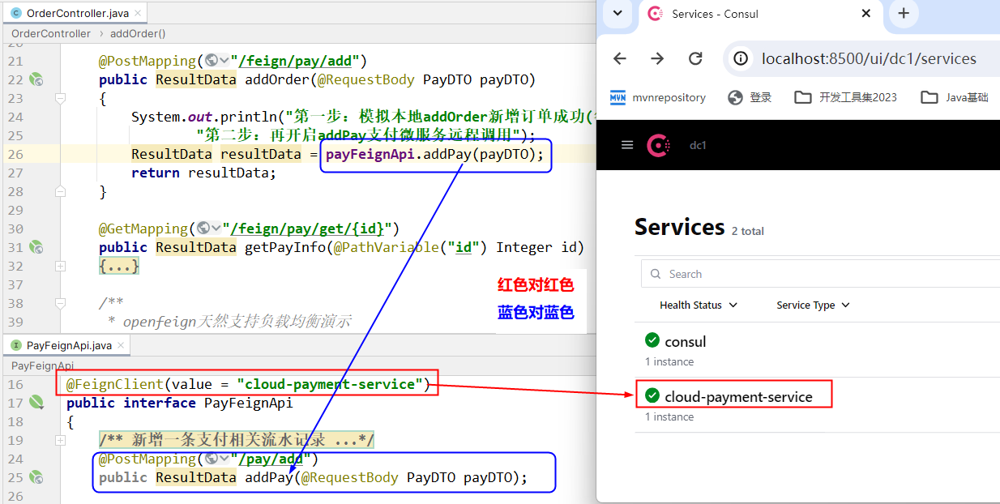


### OpenFeign高级特性

#### 超时控制

- 全局配置

  ```yaml
  spring:
    cloud:
      openfeign:
        client:
          config:
            default:
              #连接超时时间
                        connectTimeout: 3000
              #读取超时时间
                       readTimeout: 3000
  ```

  

- 指定配置

  ```yaml
  spring:
    cloud:
      openfeign:
        client:
          config:
            cloud-payment-service:
  
              #连接超时时间
                        connectTimeout: 5000
              #读取超时时间
                        readTimeout: 5000
  ```

#### 重试机制

- 默认情况

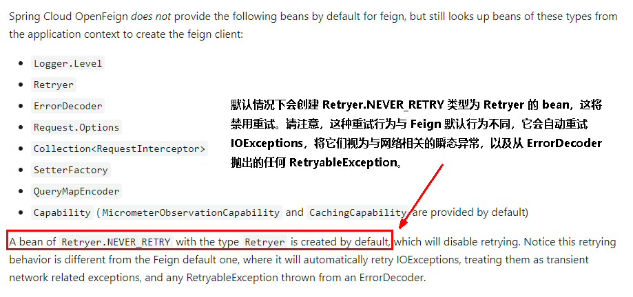

- 开启`Retryer`功能

  ```java
  @Configuration
  public class FeignConfig
  {
      @Bean
      public Retryer myRetryer()
      {
          //return Retryer.NEVER_RETRY; //Feign默认配置是不走重试策略的
  
          //最大请求次数为3(1+2)，初始间隔时间为100ms，重试间最大间隔时间为1s
          return new Retryer.Default(100,1,3);
      }
  }
  ```

#### 默认HttpClient修改

- OpenFeign默认使用JDK自带的HttpURLConnection发送HTTP请求

- 开启Apache HttpClient 5

  1. 引入pom

     ```xml
     <!-- httpclient5-->
     <dependency>
         <groupId>org.apache.httpcomponents.client5</groupId>
         <artifactId>httpclient5</artifactId>
         <version>5.3</version>
     </dependency>
     <!-- feign-hc5-->
     <dependency>
         <groupId>io.github.openfeign</groupId>
         <artifactId>feign-hc5</artifactId>
         <version>13.1</version>
     </dependency>
     ```

     

  2. 配置yml

     ```yaml
     #  Apache HttpClient5 配置开启
     spring:
       cloud:
         openfeign:
           httpclient:
             hc5:
               enabled: true
     ```

#### 请求/响应压缩

- 对请求和响应进行GZIP压缩：Spring Cloud OpenFeign支持对请求和响应进行GZIP压缩，以减少通信过程中的性能损耗。

- 细粒度化设置：对请求压缩做一些更细致的设置，比如下面的配置内容指定压缩的请求数据类型并设置了请求压缩的大小下限。

  ```yaml
  # 通过下面的两个参数设置，就能开启请求与相应的压缩功能：
  spring:
  	cloud:
  		openfeign:
  			cpmpression:
  				request:
  					enabled: true
            min-request-size: 2048 #最小触发压缩的大小
            mime-types: text/xml,application/xml,application/json #触发压缩数据类型
  				responese:
  					enable: true
  ```

#### 日志打印功能

- 日志级别

  > **NONE：默认的，不显示任何日志；**
  >
  > BASIC：仅记录请求方法、URL、响应状态码及执行时间；
  >
  > HEADERS：除了 BASIC 中定义的信息之外，还有请求和响应的头信息；
  >
  > FULL：除了 HEADERS 中定义的信息之外，还有请求和响应的正文及元数据。

- 配置日志类

  ```java
  @Configuration
  public class FeignConfig
  {
      @Bean
      Logger.Level feignLoggerLevel() {
          return Logger.Level.FULL;
      }
  }
  ```

  

- 配置yml

  ```yaml
  #公式(三段)：logging.level + 含有@FeignClient注解的完整带包名的接口名+debug
  # feign日志以什么级别监控哪个接口
  logging:
    level:
      com:
        atguigu:
          cloud:
            apis:
              PayFeignApi: debug 
  ```


## 五、CircuitBreaker断路器

### 是什么？

1. [CircuitBreaker](https://spring.io/projects/spring-cloud-circuitbreaker#overview)的目的是保护分布式系统免受故障和异常，提高系统的可用性和健壮性。

2. 当一个组件或服务出现故障时，CircuitBreaker会迅速切换到开放**OPEN状态**(保险丝跳闸断电)，阻止请求发送到该组件或服务从而避免更多的请求发送到该组件或服务。这可以减少对该组件或服务的负载，防止该组件或服务进一步崩溃，并使整个系统能够继续正常运行。同时，CircuitBreaker还可以提高系统的可用性和健壮性，因为它可以在分布式系统的各个组件之间自动切换，从而避免单点故障的问题。

   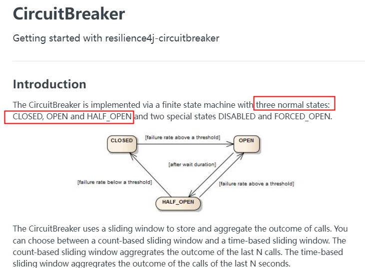

## 六、Resilience4J

### 是什么？

1. CiruitBreaker只是一套**规范和接口**，Resilience4J是落地**实现**者。
2. [Resilience4j ](https://github.com/lmhmhl/Resilience4j-Guides-Chinese/blob/main/index.md供高阶函数（装饰器），以通过断路器、速率限制器、重试或隔板增强任何功能接口、lambda 表达式或方法引用。您可以在任何函数式接口、lambda 表达式或方法引用上堆叠多个装饰器。优点是您可以选择您需要的装饰器，而没有其他选择。
3. Resilience4j 2 需要 Java 17。

### 熔断（服务熔断和服务降级）

#### 三种状态

- 关闭（closed）
- 开启（open）
- 半开（half_open）

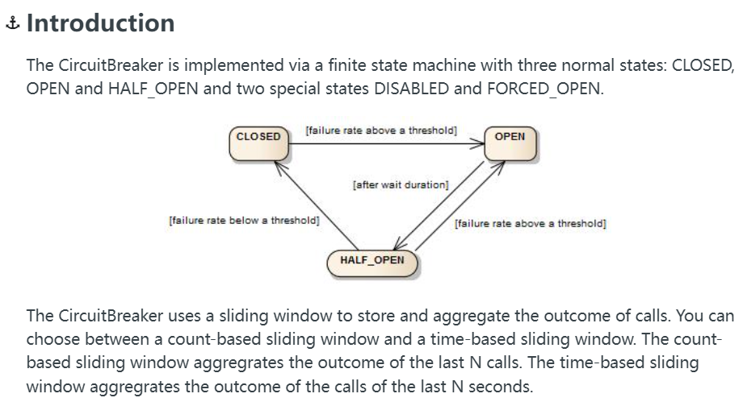

#### 参考配置

| 属性名                                           | 属性值                                                       |
| ------------------------------------------------ | ------------------------------------------------------------ |
| **failure-rate-threshold**                       | 以**百分比**配置失败率峰值                                   |
| **sliding-window-type**                          | 断路器的滑动窗口期类型 可以基于“**次数**”（COUNT_BASED）或者“时间”（TIME_BASED）进行熔断，默认是COUNT_BASED。 |
| **sliding-window-size**                          | 若COUNT_BASED，则10次调用中有50%失败（即5次）打开熔断断路器；若为TIME_BASED则，此时还有额外的两个设置属性，含义为：在N秒内（sliding-window-size）100%（slow-call-rate-threshold）的请求超过N秒（slow-call-duration-threshold）打开断路器。 |
| **slowCallRateThreshold**                        | 以**百分比**的方式配置，断路器把调用时间大于slowCallDurationThreshold的调用视为慢调用，当慢调用**比例大于等于峰值时**，断路器开启，并进入服务降级。 |
| **slowCallDurationThreshold**                    | 配置**调用时间**的峰值，高于该峰值的视为慢调用。             |
| **permitted-number-of-calls-in-half-open-state** | 运行断路器在HALF_OPEN状态下时进行N次调用，如果故障或慢速调用仍然高于阈值，断路器再次进入打开状态。 |
| **minimum-number-of-calls**                      | 在每个滑动窗口期样本数，配置断路器计算错误率或者慢调用率的最小调用数。比如设置为5意味着，在计算故障率之前，必须至少调用5次。如果只记录了4次，即使4次都失败了，断路器也不会进入到打开状态。 |
| **wait-duration-in-open-state**                  | 从**OPEN到HALF_OPEN状态**需要等待的时间                      |

#### 计数的滑动窗口（推荐）

**引入pom**

```xml
<!--resilience4j-circuitbreaker-->
<dependency>
    <groupId>org.springframework.cloud</groupId>
    <artifactId>spring-cloud-starter-circuitbreaker-resilience4j</artifactId>
</dependency>
<!-- 由于断路保护等需要AOP实现，所以必须导入AOP包 -->
<dependency>
    <groupId>org.springframework.boot</groupId>
    <artifactId>spring-boot-starter-aop</artifactId>
</dependency>
```

**修改yaml**

```yaml
# Resilience4j CircuitBreaker 按照次数：COUNT_BASED 的例子
#  6次访问中当执行方法的失败率达到50%时CircuitBreaker将进入开启OPEN状态(保险丝跳闸断电)拒绝所有请求。
#  等待5秒后，CircuitBreaker 将自动从开启OPEN状态过渡到半开HALF_OPEN状态，允许一些请求通过以测试服务是否恢复正常。
#  如还是异常CircuitBreaker 将重新进入开启OPEN状态；如正常将进入关闭CLOSE闭合状态恢复正常处理请求。
resilience4j:
  circuitbreaker:
    configs:
      default:
        failureRateThreshold: 50 #设置50%的调用失败时打开断路器，超过失败请求百分⽐CircuitBreaker变为OPEN状态。
                slidingWindowType: COUNT_BASED # 滑动窗口的类型
                slidingWindowSize: 6 #滑动窗⼝的⼤⼩配置COUNT_BASED表示6个请求，配置TIME_BASED表示6秒
                minimumNumberOfCalls: 6 #断路器计算失败率或慢调用率之前所需的最小样本(每个滑动窗口周期)。如果minimumNumberOfCalls为10，则必须最少记录10个样本，然后才能计算失败率。如果只记录了9次调用，即使所有9次调用都失败，断路器也不会开启。
                automaticTransitionFromOpenToHalfOpenEnabled: true # 是否启用自动从开启状态过渡到半开状态，默认值为true。如果启用，CircuitBreaker将自动从开启状态过渡到半开状态，并允许一些请求通过以测试服务是否恢复正常
                waitDurationInOpenState: 5s #从OPEN到HALF_OPEN状态需要等待的时间
                permittedNumberOfCallsInHalfOpenState: 2 #半开状态允许的最大请求数，默认值为10。在半开状态下，CircuitBreaker将允许最多permittedNumberOfCallsInHalfOpenState个请求通过，如果其中有任何一个请求失败，CircuitBreaker将重新进入开启状态。
                recordExceptions:
          - java.lang.Exception
    instances:
      cloud-payment-service:
        baseConfig: default
```

**编写代码**

```java
@RestController
public class OrderCircuitController
{
    @Resource
    private PayFeignApi payFeignApi;

    @GetMapping(value = "/feign/pay/circuit/{id}")
    @CircuitBreaker(name = "cloud-payment-service", fallbackMethod = "myCircuitFallback")
    public String myCircuitBreaker(@PathVariable("id") Integer id)
    {
        return payFeignApi.myCircuit(id);
    }
    //myCircuitFallback就是服务降级后的兜底处理方法
        public String myCircuitFallback(Integer id,Throwable t) {
        // 这里是容错处理逻辑，返回备用结果
        return "myCircuitFallback，系统繁忙，请稍后再试-----/(ㄒoㄒ)/~~";
    }
}
```

#### 时间的滑动窗口

**修改yaml**

```yaml
# Resilience4j CircuitBreaker 按照时间：TIME_BASED 的例子
resilience4j:
  timelimiter:
    configs:
      default:
        timeout-duration: 10s #神坑的位置，timelimiter 默认限制远程1s，超于1s就超时异常，配置了降级，就走降级逻辑
  circuitbreaker:
    configs:
      default:
        failureRateThreshold: 50 #设置50%的调用失败时打开断路器，超过失败请求百分⽐CircuitBreaker变为OPEN状态。
        slowCallDurationThreshold: 2s #慢调用时间阈值，高于这个阈值的视为慢调用并增加慢调用比例。
        slowCallRateThreshold: 30 #慢调用百分比峰值，断路器把调用时间⼤于slowCallDurationThreshold，视为慢调用，当慢调用比例高于阈值，断路器打开，并开启服务降级
        slidingWindowType: TIME_BASED # 滑动窗口的类型
        slidingWindowSize: 2 #滑动窗口的大小配置，配置TIME_BASED表示2秒
        minimumNumberOfCalls: 2 #断路器计算失败率或慢调用率之前所需的最小样本(每个滑动窗口周期)。
        permittedNumberOfCallsInHalfOpenState: 2 #半开状态允许的最大请求数，默认值为10。
        waitDurationInOpenState: 5s #从OPEN到HALF_OPEN状态需要等待的时间
        recordExceptions:
          - java.lang.Exception
    instances:
      cloud-payment-service:
        baseConfig: default 
```

### 隔离（BulkHead）

#### 能干嘛

- 依赖隔离&负载保护：用来限制对于下游服务的最大并发数量的限制

#### SemaphoreBulkhead（信号量舱壁）

**是什么**

> 信号量舱壁（SemaphoreBulkhead）原理
>
> 当信号量有空闲时，进入系统的请求会直接获取信号量并开始业务处理。
>
> 当信号量全被占用时，接下来的请求将会进入**阻塞状态**，SemaphoreBulkhead提供了一个**阻塞计时器**，
>
> 如果阻塞状态的请求在阻塞**计时内**无法获取到信号量则系统会**拒绝这些请求**。
>
> 若请求在阻塞计时内获取到了信号量，那将直接获取信号量并**执行相应的业务处理**。

**引入pom**

```xml
<!--resilience4j-bulkhead-->
<dependency>
    <groupId>io.github.resilience4j</groupId>
    <artifactId>resilience4j-bulkhead</artifactId>
</dependency>
```

**修改yaml**

```yaml
####resilience4j bulkhead 的例子
resilience4j:
  bulkhead:
    configs:
      default:
        maxConcurrentCalls: 2 # 隔离允许并发线程执行的最大数量
                maxWaitDuration: 1s # 当达到并发调用数量时，新的线程的阻塞时间，我只愿意等待1秒，过时不候进舱壁兜底fallback
    instances:
      cloud-payment-service:
        baseConfig: default
  timelimiter:
    configs:
      default:
        timeout-duration: 20s
```

**配置代码**

```java
@GetMapping(value = "/feign/pay/bulkhead/{id}")
@Bulkhead(name = "cloud-payment-service",fallbackMethod = "myBulkheadFallback",type = Bulkhead.Type.SEMAPHORE)
public String myBulkhead(@PathVariable("id") Integer id)
{
    return payFeignApi.myBulkhead(id);
}
public String myBulkheadFallback(Throwable t)
{
    return "myBulkheadFallback，隔板超出最大数量限制，系统繁忙，请稍后再试-----/(ㄒoㄒ)/~~";
}
```

#### FixedThreadPoolBulkhead（固定线程池舱壁）

**是什么**

> 固定线程池舱壁（FixedThreadPoolBulkhead）
>
> FixedThreadPoolBulkhead的功能与SemaphoreBulkhead一样也是**用于限制并发执行的次数**的，但是二者的实现原理存在差别而且表现效果也存在细微的差别。FixedThreadPoolBulkhead使用一个固定线程池和一个等待队列来实现舱壁。
>
> 当线程池中存在空闲时，则此时进入系统的请求将直接进入线程池开启新线程或使用空闲线程来处理请求。
>
> 当线程池中无空闲时时，接下来的请求将**进入等待队列**，
>
>   若等待队列仍然无剩余空间时接下来的请求将**直接被拒绝**，
>
>   在队列中的请求等待线程池出现空闲时，将进入线程池进行业务处理。
>
> 另外：**ThreadPoolBulkhead只对CompletableFuture方法有效，所以我们必创建返回CompletableFuture类型的方法**

**修改yaml**

```yaml
resilience4j:
  timelimiter:
    configs:
      default:
        timeout-duration: 10s #timelimiter默认限制远程1s，超过报错不好演示效果所以加上10秒
  thread-pool-bulkhead:
    configs:
      default:
        core-thread-pool-size: 1
        max-thread-pool-size: 1
        queue-capacity: 1
    instances:
      cloud-payment-service:
        baseConfig: default
# max-thread-pool-size:1 + queue-capacity:1 = 2
# 1个在max + 1个在等待队列，第3个来的时候报错
```

**编写代码**

```java
@GetMapping(value = "/feign/pay/bulkhead/{id}")
@Bulkhead(name = "cloud-payment-service",fallbackMethod = "myBulkheadPoolFallback",type = Bulkhead.Type.THREADPOOL)
public CompletableFuture<String> myBulkheadTHREADPOOL(@PathVariable("id") Integer id)
{
    System.out.println(Thread.currentThread().getName()+"\t"+"enter the method!!!");
    try { TimeUnit.SECONDS.sleep(3); } catch (InterruptedException e) { e.printStackTrace(); }
    System.out.println(Thread.currentThread().getName()+"\t"+"exist the method!!!");

    return CompletableFuture.supplyAsync(() -> payFeignApi.myBulkhead(id) + "\t" + " Bulkhead.Type.THREADPOOL");
}
public CompletableFuture<String> myBulkheadPoolFallback(Integer id,Throwable t)
{
    return CompletableFuture.supplyAsync(() -> "Bulkhead.Type.THREADPOOL，系统繁忙，请稍后再试-----/(ㄒoㄒ)/~~");
}
```

#### 限流（RateLimiter）

**是什么**

- 限流（频率控制）：所谓限流，就是通过对并发访问/请求进行限速，或者对一个时间窗口内的请求进行限速，以保护应用系统，一旦达到限制速率则可以**拒绝服务、排队或等待、降级**等处理。

**常见限流算法**

1. **漏桶算法**（Leaky Bucket）

   - 一个固定容量的漏桶，按照设定常量固定速率流出水滴，类似医院打吊针，不管你源头流量多大，我设定匀速流出。 如果流入水滴超出了桶的容量，则流入的水滴将会溢出了(被丢弃)，而漏桶容量是不变的。
   - **缺点**：漏桶算法对于存在**突发特性的流量**来说缺乏效率。

   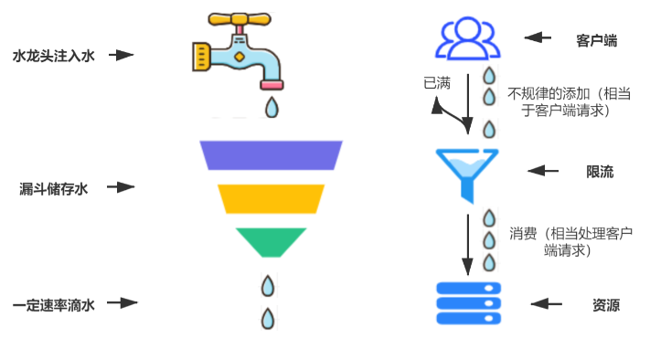

2. **令牌桶算法**（Token Bucket）

   - SpringCloud默认使用此算法
   - 令牌桶算法以一个设定的速率产生令牌并放入令牌桶，每次用户**请求都得申请令牌**，如果令牌**不足**，则**拒绝请求**。
   - 令牌桶算法中新请求到来时会从桶里拿走一个令牌，如果桶内没有令牌可拿，就拒绝服务。当然，令牌的数量也是有上限的。令牌的数量与时间和发放速率强相关，时间流逝的时间越长，会不断往桶里加入越多的令牌，如果令牌发放的速度比申请速度快，令牌桶会放满令牌，直到令牌占满整个令牌桶。

3. **滚动时间窗（Tumbling Time Window）**

   - 允许固定数量的请求进入(比如1秒取4个数据相加，超过25值就over)超过数量就拒绝或者排队，等下一个时间段进入。

   - 由于是在一个时间间隔内进行限制，如果用户在上个时间间隔结束前请求（但没有超过限制），同时在当前时间间隔刚开始请求（同样没超过限制），在各自的时间间隔内，这些请求都是正常的。下图统计了3次，but......

   - **缺点**：**由于计数器算法存在时间临界点缺陷，因此在时间临界点左右的极短时间段内容易遭到攻击。**

     > 假如设定1分钟最多可以请求100次某个接口，如12:00:00-12:00:59时间段内没有数据请求但12:00:59-12:01:00时间段内突然并发100次请求，紧接着瞬间跨入下一个计数周期计数器清零；在12:01:00-12:01:01内又有100次请求。那么也就是说在时间临界点左右可能同时有2倍的峰值进行请求，从而造成后台处理请求**加倍过载**的bug，导致系统运营能力不足，甚至导致系统崩溃，/(ㄒoㄒ)/~~


4. **滑动时间窗口（Sliding Time Window）**

   - 顾名思义，该时间窗口是滑动的。所以，从概念上讲，这里有两个方面的概念需要理解： 
     -  窗口：需要定义窗口的大小
     -  滑动：需要定义在窗口中滑动的大小，但理论上讲滑动的大小不能超过窗口大小

   - 滑动窗口算法是把固定时间片进行划分并且随着时间移动，移动方式为开始时间点变为时间列表中的第2个时间点，结束时间点增加一个时间点。
   - 不断重复，通过这种方式可以巧妙的避开计数器的临界点的问题。下图统计了5次。

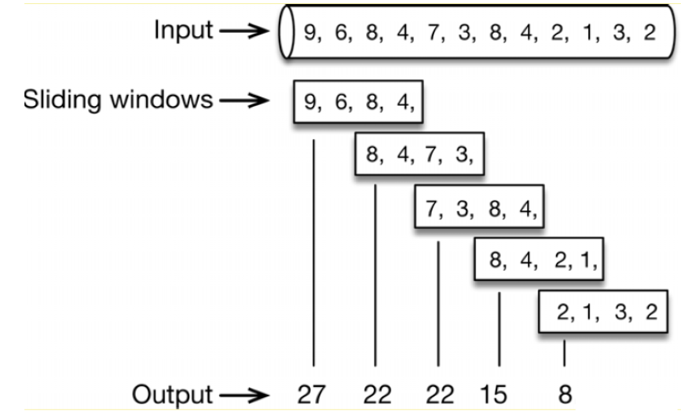

**引入pom**

```xml
<!--resilience4j-ratelimiter-->
<dependency>
    <groupId>io.github.resilience4j</groupId>
    <artifactId>resilience4j-ratelimiter</artifactId>
</dependency>
```

**修改yaml**

```yaml
####resilience4j ratelimiter 限流的例子
resilience4j:
  ratelimiter:
    configs:
      default:
        limitForPeriod: 2 #在一次刷新周期内，允许执行的最大请求数
        limitRefreshPeriod: 1s # 限流器每隔limitRefreshPeriod刷新一次，将允许处理的最大请求数量重置为limitForPeriod
        timeout-duration: 1 # 线程等待权限的默认等待时间
    instances:
        cloud-payment-service:
          baseConfig: default
```

**编写代码**

```java
@GetMapping(value = "/feign/pay/ratelimit/{id}")
@RateLimiter(name = "cloud-payment-service",fallbackMethod = "myRatelimitFallback")
public String myBulkhead(@PathVariable("id") Integer id)
{
    return payFeignApi.myRatelimit(id);
}
public String myRatelimitFallback(Integer id,Throwable t)
{
    return "你被限流了，禁止访问/(ㄒoㄒ)/~~";
}
```


## 七、Sleuth（Mecometer）+ZipKin分布式链路追踪

### 是什么？

- [Springc Cloud Sleuth（Mecometer）](https://spring.io/projects/spring-cloud-sleuth#overview)提供了一套完整的分布式链路追踪（Distributed Tracing）解决方案且兼容支持了ZipKin展现
- [Zipkin](https://zipkin.io/)是一种分布式链路跟踪系统图形化的工具，Zipkin 是 Twitter 开源的分布式跟踪系统，能够收集微服务运行过程中的实时调用链路信息，并能够将这些调用链路信息展示到**Web图形化界面**上供开发人员分析，开发人员能够从ZipKin中分析出调用链路中的性能瓶颈，识别出存在问题的应用程序，进而定位问题和解决问题。

- 案例：一条链路通过Trace Id唯一标识，Span标识发起的请求信息，各span通过parent id 关联起来

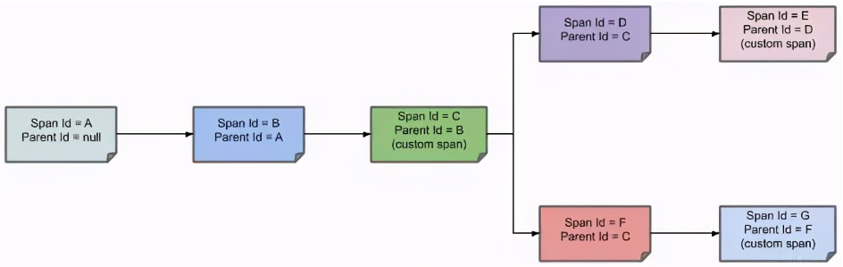

|      |                                                              |
| ---- | ------------------------------------------------------------ |
| 1    | 第一个节点：Span ID = A，Parent ID = null，Service 1 接收到请求。 |
| 2    | 第二个节点：Span ID = B，Parent ID= A，Service 1 发送请求到 Service 2 返回响应给Service 1 的过程。 |
| 3    | 第三个节点：Span ID = C，Parent ID= B，Service 2 的 中间解决过程。 |
| 4    | 第四个节点：Span ID = D，Parent ID= C，Service 2 发送请求到 Service 3 返回响应给Service 2 的过程。 |
| 5    | 第五个节点：Span ID = E，Parent ID= D，Service 3 的中间解决过程。 |
| 6    | 第六个节点：Span ID = F，Parent ID= C，Service 3 发送请求到 Service 4 返回响应给 Service 3 的过程。 |
| 7    | 第七个节点：Span ID = G，Parent ID= F，Service 4 的中间解决过程。 |
| 8    | 通过 Parent ID 就可找到父节点，整个链路即可以进行跟踪追溯了。 |

### 能干嘛？

1. 在分布式与微服务场景下，我们需要解决如下问题：

   >在大规模分布式与微服务集群下，如何实时观测系统的整体调用链路情况。
   >
   >在大规模分布式与微服务集群下，如何快速发现并定位到问题。
   >
   >在大规模分布式与微服务集群下，如何尽可能精确的判断故障对系统的影响范围与影响程度。
   >
   >在大规模分布式与微服务集群下，如何尽可能精确的梳理出服务之间的依赖关系，并判断出服务之间的依赖关系是否合理。
   >
   >在大规模分布式与微服务集群下，如何尽可能精确的分析整个系统调用链路的性能与瓶颈点。
   >
   >在大规模分布式与微服务集群下，如何尽可能精确的分析系统的存储瓶颈与容量规划。

2. 解决办法：

   - 分布式链路追踪技术要解决的问题，分布式链路追踪（Distributed Tracing），就是将一次分布式请求还原成调用链路，进行日志记录，性能监控并将一次分布式请求的调用情况集中展示。比如各个服务节点上的耗时、请求具体到达哪台机器上、每个服务节点的请求状态等等。

### 配合使用

#### Mecometer+ZipKin各自分工

- Mecometer：数据采集
- ZipKin：图形展示

#### 引入pom

```xml
<!--micrometer-tracing-bom导入链路追踪版本中心  1-->
<dependency>
    <groupId>io.micrometer</groupId>
    <artifactId>micrometer-tracing-bom</artifactId>
    <version>${micrometer-tracing.version}</version>
    <type>pom</type>
    <scope>import</scope>
</dependency>
<!--micrometer-tracing指标追踪  2-->
<dependency>
    <groupId>io.micrometer</groupId>
    <artifactId>micrometer-tracing</artifactId>
    <version>${micrometer-tracing.version}</version>
</dependency>
<!--micrometer-tracing-bridge-brave适配zipkin的桥接包 3-->
<dependency>
    <groupId>io.micrometer</groupId>
    <artifactId>micrometer-tracing-bridge-brave</artifactId>
    <version>${micrometer-tracing.version}</version>
</dependency>
<!--micrometer-observation 4-->
<dependency>
    <groupId>io.micrometer</groupId>
    <artifactId>micrometer-observation</artifactId>
    <version>${micrometer-observation.version}</version>
</dependency>
<!--feign-micrometer 5-->
<dependency>
    <groupId>io.github.openfeign</groupId>
    <artifactId>feign-micrometer</artifactId>
    <version>${feign-micrometer.version}</version>
</dependency>
<!--zipkin-reporter-brave 6-->
<dependency>
    <groupId>io.zipkin.reporter2</groupId>
    <artifactId>zipkin-reporter-brave</artifactId>
    <version>${zipkin-reporter-brave.version}</version>
</dependency>
```

#### 修改yaml

```yaml
# ========================zipkin===================
management:
  zipkin:
    tracing:
      endpoint: http://localhost:9411/api/v2/spans
  tracing:
    sampling:
      probability: 1.0 #采样率默认为0.1(0.1就是10次只能有一次被记录下来)，值越大收集越及时。
```

#### 启动

访问：http://localhost:9411/zipkin/


## 八、GateWay新一代网关

### 是什么？

1. [Gateway](https://docs.spring.io/spring-cloud-gateway/docs/4.0.4/reference/html/)是在Spring生态系统之上构建的API网关服务，基于Spring6，Spring Boot 3和Project Reactor等技术。它旨在为微服务架构提供一种简单有效**的统一的 API 路由管理方式**，并为它们提供跨领域的关注点，例如：安全性、监控/度量和恢复能力。

2. Spring Cloud Gateway组件的核心是**一系列的过滤器**，通过这些过滤器可以**将客户端发送的请求转发(路由)到对应的微服务**。 Spring Cloud Gateway是加在整个微服务最前沿的**防火墙和代理器**，隐藏微服务结点IP端口信息，从而加强安全保护。Spring Cloud Gateway本身也是一个微服务，**需要注册进服务注册中心**。

   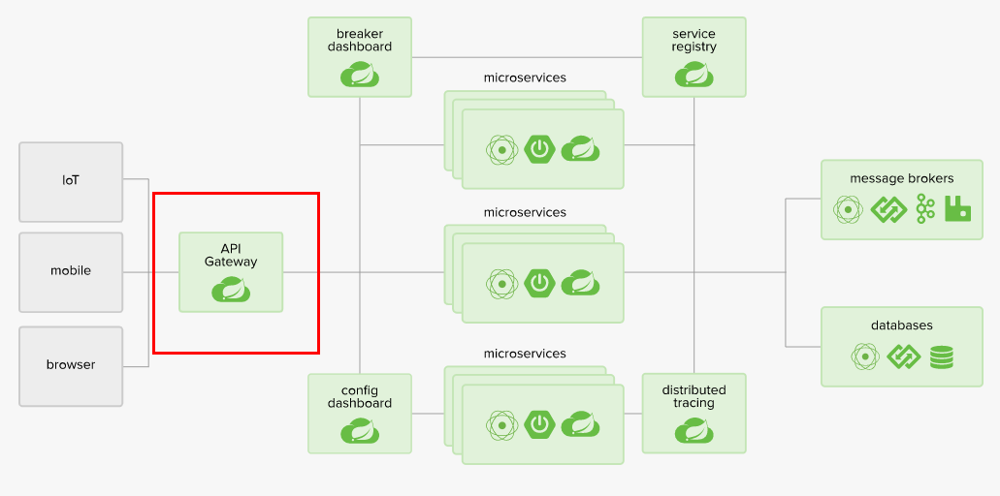

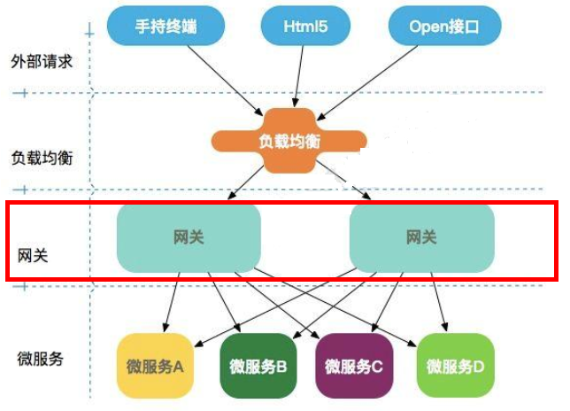

### 能干嘛？

1. 反向代理
2. 鉴权
3. 流量控制
4. 熔断
5. 日志监控

### 三大核心

1. Route（路由）：路由是构建网关的基本模块，它由ID，目标URI，一系列的断言和过滤器组成，如果断言为true则匹配该路由。
2. Predicate（断言）：参考的是Java8的java.util.function.Predicate，开发人员可以匹配HTTP请求中的所有内容（例如请求头或请求参数），**如果请求与断言相匹配则进行路由**。
3. Filter（过滤）：指的是Spring框架中GatewayFilter的实例，使用过滤器，可以在请求被路由前或者之后对请求进行修改。

### 工作流程

**路由转发 + 断言判断 + 执行过滤器链**

1. 客户端向 Spring Cloud Gateway 发出请求。然后在 Gateway Handler Mapping 中找到与请求相匹配的路由，将其发送到 Gateway Web Handler。Handler 再通过指定的过滤器链来将请求发送到我们实际的服务执行业务逻辑，然后返回。

2. 过滤器之间用虚线分开是因为过滤器可能会在发送代理请求之前(Pre)或之后(Post)执行业务逻辑。

3. 在“pre”类型的过滤器可以做参数校验、权限校验、流量监控、日志输出、协议转换等;

4. 在“post”类型的过滤器中可以做响应内容、响应头的修改，日志的输出，流量监控等有着非常重要的作用。

   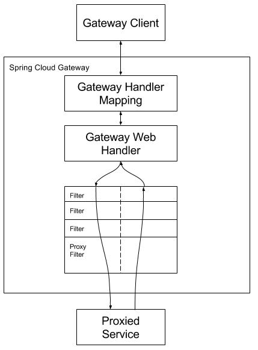

### 项目配置

#### 引入pom

```xml
 <!--gateway-->
<dependency>
	<groupId>org.springframework.cloud</groupId>
	<artifactId>spring-cloud-starter-gateway</artifactId>
</dependency>
```

#### 改写yaml

```yaml
spring:
  application:
    name: cloud-gateway #以微服务注册进consul或nacos服务列表内
  cloud:
    consul: #配置consul地址
      host: localhost
      port: 8500
      discovery:
        prefer-ip-address: true
        service-name: ${spring.application.name}
    gateway:
      routes:
        - id: pay_routh1 #pay_routh1                #路由的ID(类似mysql主键ID)，没有固定规则但要求唯一，建议配合服务名
          uri: http://localhost:8001                #匹配后提供服务的路由地址
          predicates:
            - Path=/pay/gateway/get/**              # 断言，路径相匹配的进行路由


        - id: pay_routh2 #pay_routh2                #路由的ID(类似mysql主键ID)，没有固定规则但要求唯一，建议配合服务名
          uri: http://localhost:8001                #匹配后提供服务的路由地址
          predicates:
            - Path=/pay/gateway/info/**              # 断言，路径相匹配的进行路由
```

### 代码配置

```java
@SpringBootApplication
@EnableDiscoveryClient //服务注册和发现
public class Main9527
{
    public static void main(String[] args)
    {
        SpringApplication.run(Main9527.class,args);
    }
}
```

### 高级特性

#### Route以微服务名--动态获取服务URI

```yaml
# 改写前
uri: http://localhost:8001

# 改写后
uri: lb://cloud-payment-service          #匹配后提供服务的路由地址
```

#### Predicate断言（谓词）

1. [配置语法](https://docs.spring.io/spring-cloud-gateway/docs/4.0.4/reference/html/#gateway-request-predicates-factories)概述

   - 短格式配置

     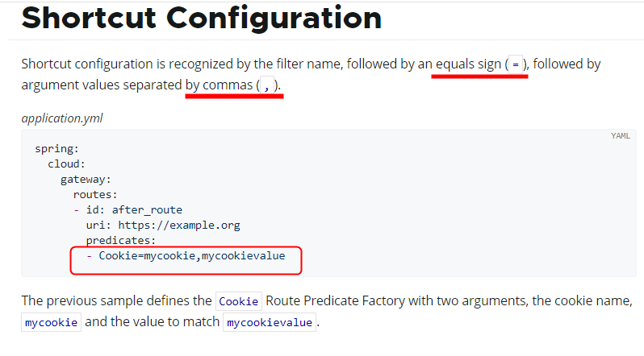

   - 长格式配置

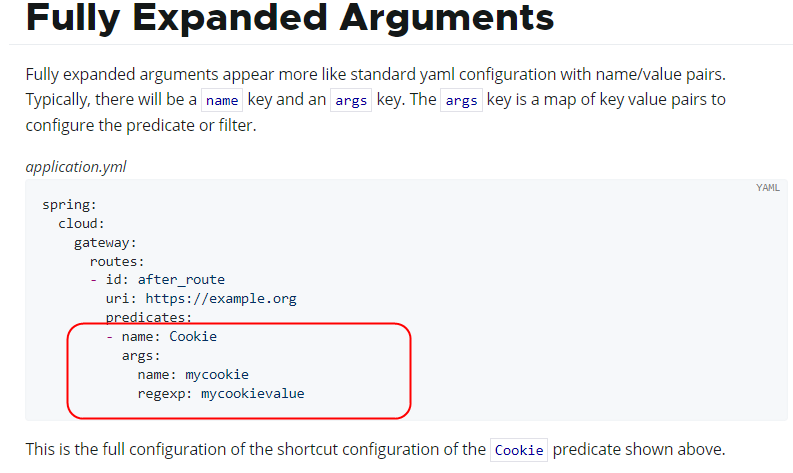

2. yaml配置

   ```yaml
    #id：我们自定义的路由 ID，保持唯一
     ##uri：目标服务地址
     ##predicates：路由条件，Predicate接受一个输入参数返回一个布尔值。
     ##            该属性包含多种默认方法来将Predicate组合成其他复杂的逻辑(比如：与，或，非)
     
     spring:
     application:
       name: cloud-gateway #以微服务注册进consul或nacos服务列表内
     cloud:
       consul: #配置consul地址
         host: localhost
         port: 8500
         discovery:
           prefer-ip-address: true
           service-name: ${spring.application.name}
       gateway:
         routes:
           - id: pay_routh1 #pay_routh1                #路由的ID(类似mysql主键ID)，没有固定规则但要求唯一，建议配合服务名
             #uri: http://localhost:8001                #匹配后提供服务的路由地址
             uri: lb://cloud-payment-service
             predicates:
               - Path=/pay/gateway/get/**              # 断言，路径相匹配的进行路由
   #            - After=2024-05-18T00:29:00.876342+08:00[Asia/Shanghai]
   #            - Before=2024-05-18T00:29:00.876342+08:00[Asia/Shanghai]
   #            - Between=2024-05-18T00:29:00.876342+08:00[Asia/Shanghai], 2024-05-18T00:29:00.876342+08:00[Asia/Shanghai]
   #            - Cookie=username,cxx
   #            - Header=X-Request-Id, \d+ #请求头要有 X-Request-Id 属性，并且值为整数才能访问
   #            - Host=**.somehost.org,**.anotherhost.org
   #            - Method=GET,POST
   #            - Query=username, \d+  # 要有参数名为 username，并且值为整数才能访问
   #            - RemoteAddr=172.20.10.2/24  # 限定外网访问的网络号，目前 24 表示 前24位 必须相同
               - My=jin
   
           - id: pay_routh2 #pay_routh2                #路由的ID(类似mysql主键ID)，没有固定规则但要求唯一，建议配合服务名
             #uri: http://localhost:8001                #匹配后提供服务的路由地址
             uri: lb://cloud-payment-service
             predicates:
               - Path=/pay/gateway/info/**              # 断言，路径相匹配的进行路由
   
           - id: pay_routh3 #pay_routh3
             uri: lb://cloud-payment-service                #匹配后提供服务的路由地址
             predicates:
               - Path=/pay/gateway/filter/**              # 断言，路径相匹配的进行路由
   #            - Path=/gateway/filter/**              # 断言，为配合PrefixPath测试过滤，暂时注释掉/pay
   #            - Path=/XYZ/abc/{segment}           # 断言，为配合SetPath测试，{segment}的内容最后被SetPath取代
   ```

3. 自定义断言

   - 继承`AbstractRoutePredicateFactory<MyRoutePredicateFactory.Config>`
   - 重写`apply`方法
   - 新建`apply`方法所需的`Config`内部静态类，**这个方法就是我们路由断言规则**
   - 空参构造方法，内部调用`super`
   - 重写`shortcutFieldOrder`方法，**开启短格式配置**

   ```java
   @Component
   public class MyRoutePredicateFactory extends AbstractRoutePredicateFactory<MyRoutePredicateFactory.Config>
   {
       public MyRoutePredicateFactory()
       {
           super(MyRoutePredicateFactory.Config.class);
       }
   
       @Validated
       public static class Config{
           @Setter
           @Getter
           @NotEmpty
           private String userType; //钻、金、银等用户等级
       }
   
       @Override
       public Predicate<ServerWebExchange> apply(MyRoutePredicateFactory.Config config)
       {
           return new Predicate<ServerWebExchange>()
           {
               @Override
               public boolean test(ServerWebExchange serverWebExchange)
               {
                   //检查request的参数里面，userType是否为指定的值，符合配置就通过
                   String userType = serverWebExchange.getRequest().getQueryParams().getFirst("userType");
   
                   if (userType == null) return false;
   
                   //如果说参数存在，就和config的数据进行比较
                   if(userType.equals(config.getUserType())) {
                       return true;
                   }
   
                   return false;
               }
           };
       }
   }
   ```

#### Filter过滤

1. [配置语法](https://docs.spring.io/spring-cloud-gateway/docs/4.0.4/reference/html/#gatewayfilter-factories)概述

   ```yaml
   server:
     port: 9527
   
   spring:
     application:
       name: cloud-gateway #以微服务注册进consul或nacos服务列表内
     cloud:
       consul: #配置consul地址
         host: localhost
         port: 8500
         discovery:
           prefer-ip-address: true
           service-name: ${spring.application.name}
       gateway:
         routes:
           - id: pay_routh3 #pay_routh3
             uri: lb://cloud-payment-service                #匹配后提供服务的路由地址
             filters:
   #            - AddRequestHeader=X-Request-atguigu1,atguiguValue1  # 请求头kv，若一头含有多参则重写一行设置
   #            - AddRequestHeader=X-Request-atguigu2,atguiguValue2
   #            - RemoveRequestHeader=sec-fetch-site      # 删除请求头sec-fetch-site
   #            - SetRequestHeader=sec-fetch-mode, Blue-updatebyzzyy # 将请求头sec-fetch-mode对应的值修改为Blue-updatebyzzyy
   
   #            - AddRequestParameter=customerId,9527001 # 新增请求参数Parameter：k ，v
   #            - RemoveRequestParameter=customerName   # 删除url请求参数customerName，你传递过来也是null
   
   #            - AddResponseHeader=X-Response-atguigu, BlueResponse # 新增请求参数X-Response-atguigu并设值为BlueResponse
   #            - SetResponseHeader=Date,2099-11-11 # 设置回应头Date值为2099-11-11
   #            - RemoveResponseHeader=Content-Type # 将默认自带Content-Type回应属性删除
   
   #            - PrefixPath=/pay # http://localhost:9527/pay/gateway/filter
   #            - SetPath=/pay/gateway/{segment}  # {segment}表示占位符，你写abc也行但要上下一致
   #            - RedirectTo=302, http://www.atguigu.com/ # 访问http://localhost:9527/pay/gateway/filter跳转到http://www.atguigu.com/
               - My=atguigu
   ```

2. 自定义过滤器

   - 继承`AbstractGatewayFilterFactory<MyGatewayFilterFactory.Config>`类
   - 新建`Config`静态内部类
   - 重写`apply`方法
   - 重写`shortcutFieldOrder`方法
   - 空参构造方法，内部调用`super`

   ```java
   public class MyGatewayFilterFactory extends AbstractGatewayFilterFactory<MyGatewayFilterFactory.Config>
   {
       public MyGatewayFilterFactory()
       {
           super(MyGatewayFilterFactory.Config.class);
       }
   
   
       @Override
       public GatewayFilter apply(MyGatewayFilterFactory.Config config)
       {
           return new GatewayFilter()
           {
               @Override
               public Mono<Void> filter(ServerWebExchange exchange, GatewayFilterChain chain)
               {
                   ServerHttpRequest request = exchange.getRequest();
                   System.out.println("进入了自定义网关过滤器MyGatewayFilterFactory，status："+config.getStatus());
                   if(request.getQueryParams().containsKey("atguigu")){
                       return chain.filter(exchange);
                   }else{
                       exchange.getResponse().setStatusCode(HttpStatus.BAD_REQUEST);
                       return exchange.getResponse().setComplete();
                   }
               }
           };
       }
   
       @Override
       public List<String> shortcutFieldOrder() {
           return Arrays.asList("status");
       }
   
       public static class Config
       {
           @Getter@Setter
           private String status;//设定一个状态值/标志位，它等于多少，匹配和才可以访问
       }
   }
   ```

   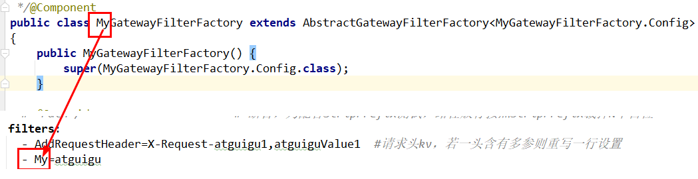


## 九、Spring Cloud Alibaba

### 是什么？

1. [Spring Cloud Alibaba](https://spring.io/projects/spring-cloud-alibaba) 致力于提供微服务开发的一站式解决方案。此项目包含开发分布式应用微服务的必需组件，方便开发者通过 Spring Cloud 编程模型轻松使用这些组件来开发分布式应用服务。
2. 依托 Spring Cloud Alibaba，您只需要添加一些注解和少量配置，就可以将 Spring Cloud 应用接入阿里微服务解决方案，通过阿里中间件来迅速搭建分布式应用系统。
3. 此外，阿里云同时还提供了 Spring Cloud Alibaba 企业版 [微服务解决方案](https://www.aliyun.com/product/aliware/mse?spm=github.spring.com.topbar)，包括无侵入服务治理(全链路灰度，无损上下线，离群实例摘除等)，企业级 Nacos 注册配置中心和企业级云原生网关等众多产品。

### 能干嘛？

- **服务限流降级**：默认支持 WebServlet、WebFlux、OpenFeign、RestTemplate、Spring Cloud Gateway、Dubbo 和 RocketMQ 限流降级功能的接入，可以在运行时通过控制台实时修改限流降级规则，还支持查看限流降级 Metrics 监控。
- **服务注册与发现**：适配 Spring Cloud 服务注册与发现标准，默认集成对应 Spring Cloud 版本所支持的负载均衡组件的适配。
- **分布式配置管理**：支持分布式系统中的外部化配置，配置更改时自动刷新。
- **消息驱动能力**：基于 Spring Cloud Stream 为微服务应用构建消息驱动能力。
- **分布式事务**：使用 @GlobalTransactional 注解， 高效并且对业务零侵入地解决分布式事务问题。
- **阿里云对象存储**：阿里云提供的海量、安全、低成本、高可靠的云存储服务。支持在任何应用、任何时间、任何地点存储和访问任意类型的数据。
- **分布式任务调度**：提供秒级、精准、高可靠、高可用的定时（基于 Cron 表达式）任务调度服务。同时提供分布式的任务执行模型，如网格任务。网格任务支持海量子任务均匀分配到所有 Worker（schedulerx-client）上执行。
- **阿里云短信服务**：覆盖全球的短信服务，友好、高效、智能的互联化通讯能力，帮助企业迅速搭建客户触达通道。

### 参考手册

https://spring-cloud-alibaba-group.github.io/github-pages/2022/zh-cn/2022.0.0.0-RC2.html

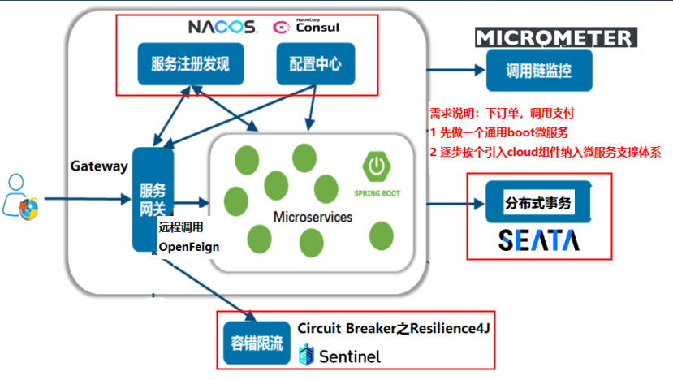


## 十、Nacos服务注册与配置中心

### 是什么？

1. 前四个字母分别为**Na**ming和**Co**nfiguration的前两个字母，最后的**s**为Service
2. 一个更易于构建云原生应用的动态服务发现、配置管理和服务管理平台。
3. `Nacos`就是注册中心 + 配置中心的管理，等价于`Consul`
4. **Nacos默认是AP模式**

### 下载安装、运行

1. 下载地址：https://github.com/alibaba/nacos/releases
2. `bin`目录下运行`sh startup.sh -m standalone`
3. 访问`http://localhost:8848/nacos`

### 服务注册中心

#### 引入pom

```xml
<!--nacos-discovery-->
<dependency>
	<groupId>com.alibaba.cloud</groupId>
	<artifactId>spring-cloud-starter-alibaba-nacos-discovery</artifactId>
</dependency>
```

#### 配置yaml

```yaml
spring:
  application:
    name: nacos-payment-provider
  cloud:
    nacos:
      discovery:
        server-addr: localhost:8848 #配置Nacos地址
# 如果不想使用Nacos作为服务注册与发现，可将 spring.cloud.nacos.dicovery.enabled 设置为 false
```

#### 配置代码

```java
@SpringBootApplication
@EnableDiscoveryClient
public class Main9001
{
    public static void main(String[] args)
    {
        SpringApplication.run(Main9001.class,args);
    }
}
```

#### 负载均衡

```java
@Configuration
public class RestTemplateConfig
{
    @Bean
    @LoadBalanced //赋予RestTemplate负载均衡的能力
    public RestTemplate restTemplate()
    {
        return new RestTemplate();
    }
}
```

### 服务配置中心

#### 引入pom

```xml
<!--bootstrap-->
        <dependency>
            <groupId>org.springframework.cloud</groupId>
            <artifactId>spring-cloud-starter-bootstrap</artifactId>
        </dependency>
        <!--nacos-config-->
        <dependency>
            <groupId>com.alibaba.cloud</groupId>
            <artifactId>spring-cloud-starter-alibaba-nacos-config</artifactId>
        </dependency>
```

#### 修改yaml

**为什么有两个yaml文件？**

1. Nacos同Consul一样，在项目初始化时，要保证先从配置中心进行配置拉取，拉取配置之后，才能保证项目的正常启动，为了满足动态刷新和全局广播通知

2. springboot中配置文件的加载是存在优先级顺序的，bootstrap优**先级高于**application

   - bootstrap.yaml（必须使用该文件来配置Nacos Server地址

     ```yaml
     # nacos配置
     spring:
       application:
         name: nacos-config-client
       cloud:
         nacos:
           discovery:
             server-addr: localhost:8848 #Nacos服务注册中心地址
           config:
             server-addr: localhost:8848 #Nacos作为配置中心地址
             file-extension: yaml #指定yaml格式的配置
     
     # nacos端配置文件DataId的命名规则是：
     # ${spring.application.name}-${spring.profile.active}.${spring.cloud.nacos.config.file-extension}
     # 本案例的DataID是:nacos-config-client-dev.yaml
     ```

   - application.yaml

     ```yaml
     spring:
       profiles:
         active: dev # 表示开发环境
            #active: prod # 表示生产环境
            #active: test # 表示测试环境
     ```

3. Nacos中的匹配规则

   - nacos端配置文件DataId的命名规则是：

     `${spring.application.name}-${spring.profile.active}.${spring.cloud.nacos.config.file-extension}`

   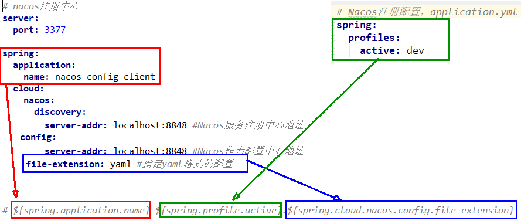

#### 编写代码

```java
@EnableDiscoveryClient
@SpringBootApplication
public class NacosConfigClient3377
{
    public static void main(String[] args)
    {
        SpringApplication.run(NacosConfigClient3377.class,args);
    }
}

@RestController
@RefreshScope //在控制器类加入@RefreshScope注解使当前类下的配置支持Nacos的动态刷新功能。
public class NacosConfigClientController
{
    @Value("${config.info}")
    private String configInfo;

    @GetMapping("/config/info")
    public String getConfigInfo() {
        return configInfo;
    }
}
```

### NameSpace-Group-DataID

#### 修改yaml

- bootstrap.yaml

  ```yaml
  # nacos配置 第3种:新建空间+新建分组+新建DataID
  spring:
    application:
      name: nacos-config-client
    cloud:
      nacos:
        discovery:
          server-addr: localhost:8848 #Nacos服务注册中心地址
        config:
          server-addr: localhost:8848 #Nacos作为配置中心地址
          file-extension: yaml #指定yaml格式的配置
          group: PROD_GROUP
          namespace: Prod_Namespace
  ```

- application.yaml

  ```yaml
  spring:
    profiles:
      #active: dev # 表示开发环境
      #active: test # 表示测试环境
      active: prod # 表示生产环境
  ```


## 十一、Sentinel实现熔断与限流

### 是什么？

###  能干嘛？

1. 丰富的应用场景：Sentinel 承接了阿里巴巴近 10 年的双十一大促流量的核心场景，例如秒杀（即突发流量控制在系统容量可以承受的范围）、消息削峰填谷、集群流量控制、实时熔断下游不可用应用等。

2. 完备的实时监控：Sentinel 同时提供实时的监控功能。您可以在控制台中看到接入应用的单台机器秒级数据，甚至 500 台以下规模的集群的汇总运行情况。

3. 广泛的开源生态：Sentinel 提供开箱即用的与其它开源框架/库的整合模块，例如与 Spring Cloud、Apache Dubbo、gRPC、Quarkus 的整合。您只需要引入相应的依赖并进行简单的配置即可快速地接入 Sentinel。同时 Sentinel 提供 Java/Go/C++ 等多语言的原生实现。

4. 完善的 SPI 扩展机制：Sentinel 提供简单易用、完善的 SPI 扩展接口。您可以通过实现扩展接口来快速地定制逻辑。例如定制规则管理、适配动态数据源等。

5. Sentinel的主要特性

   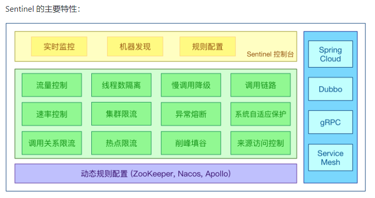

### 解决的问题

1. **服务雪崩**

   >  多个微服务之间调用的时候，假设微服务A调用微服务B和微服务C，微服务B和微服务C又调用其它的微服务，这就是所谓的“**扇出**”。如果扇出的链路上某个微服务的调用响应时间过长或者不可用，对微服务A的调用就会占用越来越多的系统资源，进而引起系统崩溃，所谓的“雪崩效应”。对于高流量的应用来说，单一的后端依赖可能会导致所有服务器上的所有资源都在几秒钟内饱和。比失败更糟糕的是，这些应用程序还可能导致服务之间的延迟增加，备份队列，线程和其他系统资源紧张，导致整个系统发生更多的级联故障。这些都表示需要对故障和延迟进行隔离和管理，以便单个依赖关系的失败，不能取消整个应用程序或系统。所以，通常当你发现一个模块下的某个实例失败后，这时候这个模块依然还会接收流量，然后这个有问题的模块还调用了其他的模块，这样就会发生级联故障，或者叫雪崩。**复杂分布式体系结构中的应用程序有数十个依赖关系，每个依赖关系在某些时候将不可避免地失败。**

2. **服务降级**

   > 服务降级，说白了就是一种服务托底方案，如果服务无法完成正常的调用流程，就使用默认的托底方案来返回数据。
   >
   > 
   >
   > 例如，在商品详情页一般都会展示商品的介绍信息，一旦商品详情页系统出现故障无法调用时，会直接获取缓存中的商品介绍信息返回给前端页面。

3. **服务熔断**

   > 在分布式与微服务系统中，如果下游服务因为访问压力过大导致响应很慢或者一直调用失败时，上游服务为了保证系统的整体可用性，会暂时断开与下游服务的调用连接。这种方式就是熔断。**类比保险丝达到最大服务访问后，直接拒绝访问，拉闸限电，然后调用服务降级的方法并返回友好提示。**
   >
   > 
   >
   > 服务熔断一般情况下会有三种状态：闭合、开启和半熔断;
   >
   > 
   >
   > 闭合状态(保险丝闭合通电OK)：服务一切正常，没有故障时，上游服务调用下游服务时，不会有任何限制。
   >
   > 开启状态(保险丝断开通电Error)：上游服务不再调用下游服务的接口，会直接返回上游服务中预定的方法。
   >
   > 半熔断状态：处于开启状态时，上游服务会根据一定的规则，尝试恢复对下游服务的调用。此时，上游服务会以有限的流量来调用下游服务，同时，会监控调用的成功率。如果成功率达到预期，则进入关闭状态。如果未达到预期，会重新进入开启状态。

4. **服务限流**

   > 服务限流就是限制进入系统的流量，以防止进入系统的流量过大而压垮系统。其主要的作用就是保护服务节点或者集群后面的数据节点，防止瞬时流量过大使服务和数据崩溃（如前端缓存大量实效），造成不可用；还可用于平滑请求，类似秒杀高并发等操作，严禁一窝蜂的过来拥挤，大家排队，一秒钟N个，有序进行。
   >
   > 
   >
   > 限流算法有两种，一种就是简单的请求总量计数，一种就是时间窗口限流（一般为1s），如令牌桶算法和漏牌桶算法就是时间窗口的限流算法。

5. **服务隔离**

   > 有点类似于系统的垂直拆分，就按照一定的规则将系统划分成多个服务模块，并且每个服务模块之间是互相独立的，不会存在强依赖的关系。如果某个拆分后的服务发生故障后，能够将故障产生的影响限制在某个具体的服务内，不会向其他服务扩散，自然也就不会对整体服务产生致命的影响。
   >
   > 
   >
   > 互联网行业常用的服务隔离方式有：线程池隔离和信号量隔离。

6. **服务超时**

   > 整个系统采用分布式和微服务架构后，系统被拆分成一个个小服务，就会存在服务与服务之间互相调用的现象，从而形成一个个调用链。
   >
   > 
   >
   > 形成调用链关系的两个服务中，主动调用其他服务接口的服务处于调用链的上游，提供接口供其他服务调用的服务处于调用链的下游。服务超时就是在上游服务调用下游服务时，设置一个最大响应时间，如果超过这个最大响应时间下游服务还未返回结果，则断开上游服务与下游服务之间的请求连接，释放资源。

### 安装与运行

1. 安装地址：https://github.com/alibaba/Sentinel/releases
2. 运行`java -jar sentinel-dashboard-1.8.6.jar`命令
3. 访问`localhost:8080`
4. 账号密码均为`sentinel`

### 配置项目

#### 引入pom

```xml
 <!--SpringCloud alibaba sentinel -->
        <dependency>
            <groupId>com.alibaba.cloud</groupId>
            <artifactId>spring-cloud-starter-alibaba-sentinel</artifactId>
        </dependency>
```

#### 改写yaml

```yaml
spring:
  application:
    name: cloudalibaba-sentinel-service
  cloud:
    nacos:
      discovery:
        server-addr: localhost:8848         #Nacos服务注册中心地址
    sentinel:
      transport:
        dashboard: localhost:8080 #配置Sentinel dashboard控制台服务地址
        port: 8719 #默认8719端口，假如被占用会自动从8719开始依次+1扫描,直至找到未被占用的端口
```

### 流控规则

#### 流控模式

1. **直接:**

   > 表示1秒钟内查询1次就是OK，若超过次数1，就直接-快速失败，报默认错误

   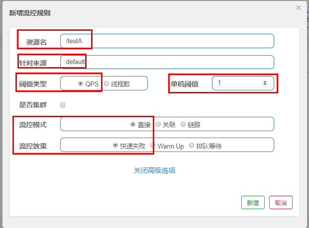

2. **关联:**

   > 当关联资源/testB的qps阀值超过1时，就限流/testA的Rest访问地址，当关联资源到阈值后限制配置好的资源名，B惹事，A挂了

   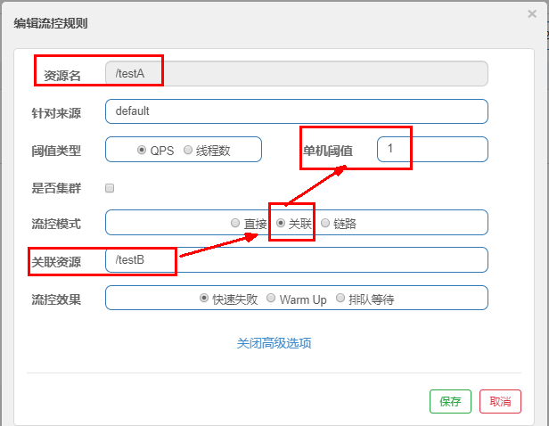

3. **链路:**

   - 改写yaml

     ```yaml
     sentinel:
           transport:
             dashboard: localhost:8080 #配置Sentinel dashboard控制台服务地址
                     port: 8719 #默认8719端口，假如被占用会自动从8719开始依次+1扫描,直至找到未被占用的端口
                 web-context-unify: false # controller层的方法对service层调用不认为是同一个根链路
     ```

   - 编写代码

     ```java
     @Service
     public class FlowLimitService
     {
         @SentinelResource(value = "common")
         public void common()
         {
             System.out.println("------FlowLimitService come in");
         }
     }		
     ```

   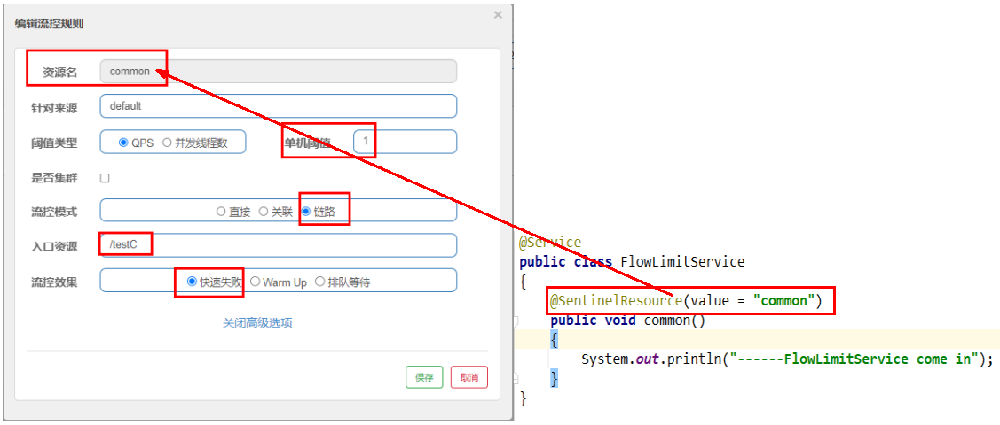

#### 流控效果

1. **直接失败**：直接失败，抛出异常

2. **预热WarmUp**:

   - **默认 coldFactor 为 3，即请求QPS从(threshold / 3) 开始，经多少预热时长才逐渐升至设定的 QPS 阈值。**
   - 案例，单机阈值为10，预热时长设置5秒。系统初始化的阈值为10 / 3 约等于3,即单机阈值刚开始为3(我们人工设定单机阈值是10，sentinel计算后QPS判定为3开始)；然后过了5秒后阀值才慢慢升高恢复到设置的单机阈值10，也就是说5秒钟内QPS为3，过了保护期5秒后QPS为10

   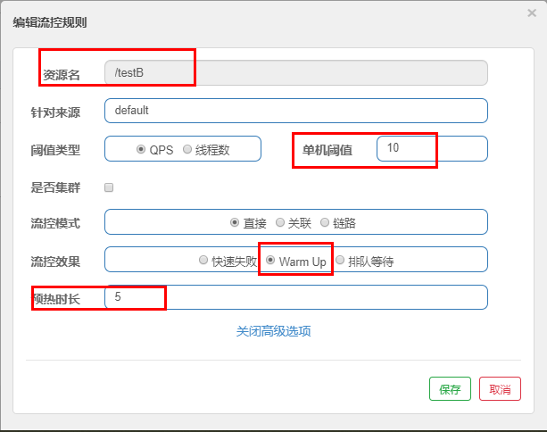

3. **排队等待**：

   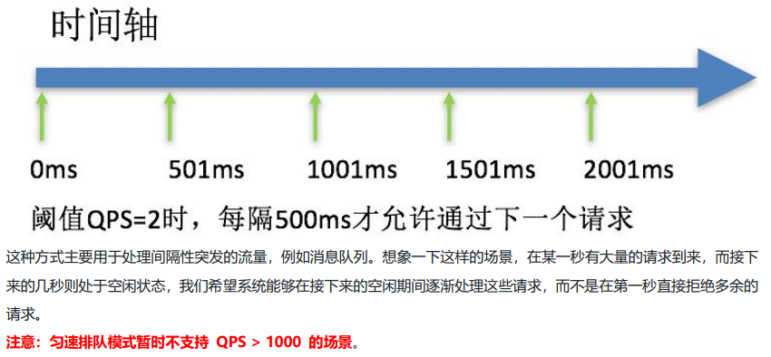

   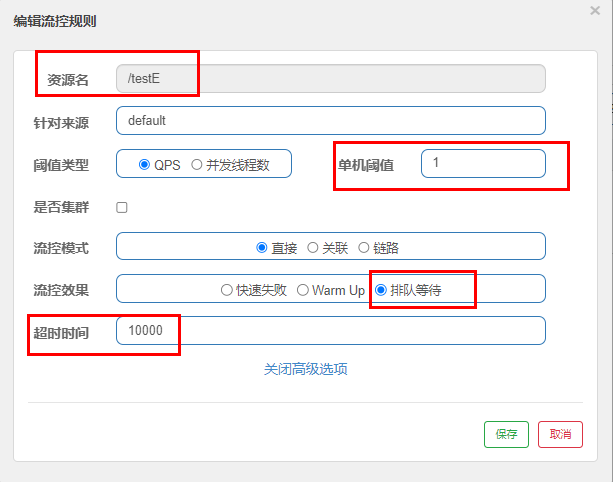

### 熔断规则

#### 慢调用比例

1. 选择以慢调用比例作为阈值，需要设置允许的慢调用 RT（即最大的响应时间），请求的响应时间大于该值则统计为慢调用。当单位统计时长（`statIntervalMs`）内请求数目大于设置的最小请求数目，并且慢调用的比例大于阈值，则接下来的熔断时长内请求会自动被熔断。经过熔断时长后熔断器会进入探测恢复状态（HALF-OPEN 状态），若接下来的一个请求响应时间小于设置的慢调用 RT 则结束熔断，若大于设置的慢调用 RT 则会再次被熔断。

2. 名词解释

   - 调用：一个请求发送到服务器，服务器给与响应，一个响应就是一个调用。
   - 最大RT：即最大的响应时间，指系统对请求作出响应的业务处理时间。
   - 慢调用：处理业务逻辑的实际时间>设置的最大RT时间，这个调用叫做慢调用。
   - 慢调用比例：在所以调用中，慢调用占有实际的比例＝慢调用次数➗总调用次数
   - 比例阈值：自己设定的 ， 比例阈值＝慢调用次数➗调用次数
   - 统计时长：时间的判断依据
   - 最小请求数：设置的调用最小请求数，上图比如1秒钟打进来10个线程（大于我们配置的5个了）调用被触发

   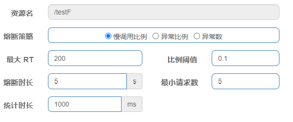

3. 触发条件

   - 进入熔断状态判断依据：在统计时长内，实际请求数目＞设定的最小请求数  且   实际慢调用比例＞比例阈值 ，进入熔断状态。

4. 熔断状态

   - 熔断状态(保险丝跳闸断电，不可访问)：在接下来的熔断时长内请求会自动被熔断
   - 探测恢复状态(探路先锋)：熔断时长结束后进入探测恢复状态
   - 结束熔断(保险丝闭合恢复，可以访问)：在探测恢复状态，如果接下来的一个请求响应时间小于设置的慢调用 RT，则结束熔断，否则继续熔断。

#### 异常比例

1. 当单位统计时长（`statIntervalMs`）内请求数目大于设置的最小请求数目，并且异常的比例大于阈值，则接下来的熔断时长内请求会自动被熔断。经过熔断时长后熔断器会进入探测恢复状态（HALF-OPEN 状态），若接下来的一个请求成功完成（没有错误）则结束熔断，否则会再次被熔断。异常比率的阈值范围是 `[0.0, 1.0]`，代表 0% - 100%。

#### 异常数

1. 当单位统计时长内的异常数目超过阈值之后会自动进行熔断。经过熔断时长后熔断器会进入探测恢复状态（HALF-OPEN 状态），若接下来的一个请求成功完成（没有错误）则结束熔断，否则会再次被熔断。

### @SentinelResource

#### 是什么？

- SentineIResource是一个流量防卫防护组件注解，用于指定防护资源，对配置的资源进行流量控制、熔断降级等功能。

#### 自定义限流返回

```java
@GetMapping("/rateLimit/byResource")
    @SentinelResource(value = "byResourceSentinelResource",blockHandler = "handleException")
    public String byResource()
    {
        return "按资源名称SentinelResource限流测试OK";
    }

    public String handleException(BlockException exception)
    {
        return "服务不可用@SentinelResource启动"+"\t"+"o(╥﹏╥)o";
    }
```

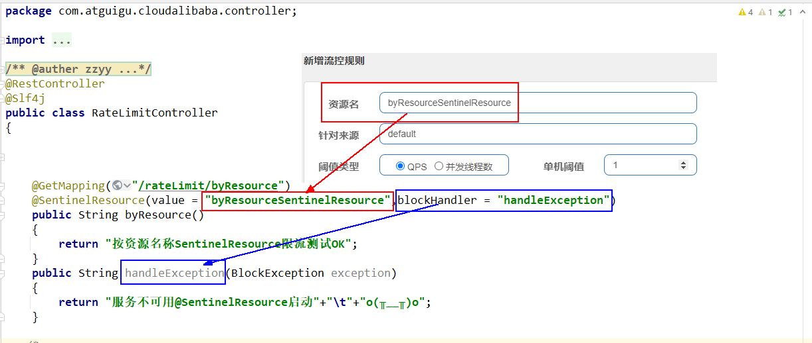

#### 自定义限流返回 + 服务降级处理

```java
    @GetMapping("/rateLimit/doAction/{p1}")
    @SentinelResource(value = "doActionSentinelResource",
            blockHandler = "doActionBlockHandler", fallback = "doActionFallback")
    public String doAction(@PathVariable("p1") Integer p1) {
        if (p1 == 0){
            throw new RuntimeException("p1等于零直接异常");
        }
        return "doAction";
    }

    public String doActionBlockHandler(@PathVariable("p1") Integer p1,BlockException e){
        log.error("sentinel配置自定义限流了:{}", e);
        return "sentinel配置自定义限流了";
    }

    public String doActionFallback(@PathVariable("p1") Integer p1,Throwable e){
        log.error("程序逻辑异常了:{}", e);
        return "程序逻辑异常了"+"\t"+e.getMessage();
    }
```

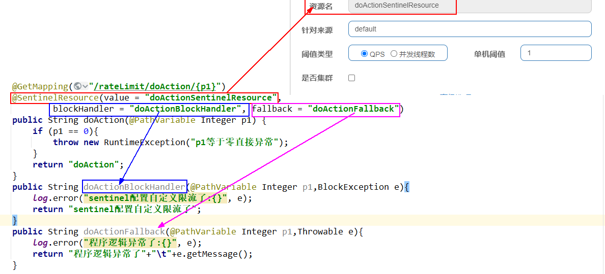

#### 小结

1. `blockHanlder`主要针对sentinel配置出现的违规情况处理
2. `fallback`，程序异常后，JVM抛出的异常服务降级
3. 两者可以共存

### 热点规则

#### 是什么？

- 热点即经常访问的数据，很多时候我们希望统计或者限制某个热点数据中访问频次最高的TopN数据，并对其访问进行限流或者其它操作

#### 编写代码

```java
@GetMapping("/testHotKey")
@SentinelResource(value = "testHotKey",blockHandler = "dealHandler_testHotKey")
public String testHotKey(@RequestParam(value = "p1",required = false) String p1, 

                         @RequestParam(value = "p2",required = false) String p2){
    return "------testHotKey";
}
public String dealHandler_testHotKey(String p1,String p2,BlockException exception)
{
    return "-----dealHandler_testHotKey";
}
```

#### 配置规则

1. 限流模式只支持QPS模式，固定写死了。（这才叫热点）
2. @SentinelResource注解的方法参数索引，**0代表第一个参数**，1代表第二个参数，以此类推
3. 单机阀值以及统计窗口时长表示在此窗口时间超过阀值就限流。
4. 下面案例表示：第一个参数有值的话，1秒的QPS为1，超过就限流，限流后调用dealHandler_testHotKey支持方法。

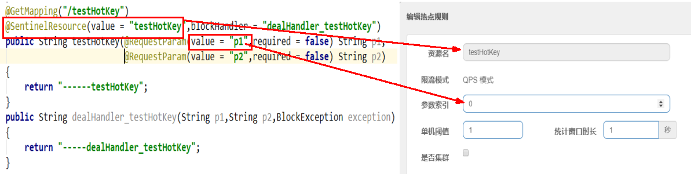

#### 热点例外项

- 当热点参数为某个值时可以**不遵守单机阈值**，而是遵守限流阈值。


### 授权规则

#### 是什么？

1. 在某些场景下，需要根据调用接口的来源判断是否允许执行本次请求。此时就可以使用Sentinel提供的授权规则来实现，Sentinel的授权规则能够根据请求的来源判断是否允许本次请求通过。
2. 在Sentinel的授权规则中，提供了 白名单与黑名单 两种授权类型。**白放行、黑禁止**

#### 配置

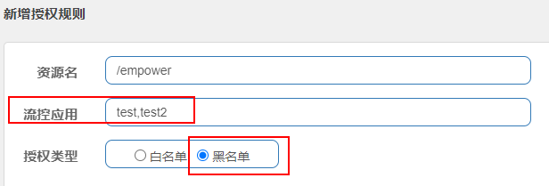

### 规则持久化

#### 引入pom

```xml
<!--SpringCloud ailibaba sentinel-datasource-nacos -->
        <dependency>
            <groupId>com.alibaba.csp</groupId>
            <artifactId>sentinel-datasource-nacos</artifactId>
        </dependency>
```

#### 修改yaml

```yaml
spring:
  application:
    name: cloudalibaba-sentinel-service #8401微服务提供者后续将会被纳入阿里巴巴sentinel监管
  cloud:
    nacos:
      discovery:
        server-addr: localhost:8848         #Nacos服务注册中心地址
    sentinel:
      transport:
        dashboard: localhost:8080 #配置Sentinel dashboard控制台服务地址
                port: 8719 #默认8719端口，假如被占用会自动从8719开始依次+1扫描,直至找到未被占用的端口
            web-context-unify: false # controller层的方法对service层调用不认为是同一个根链路
            datasource:
         ds1:
           nacos:
             server-addr: localhost:8848
             dataId: ${spring.application.name}
             groupId: DEFAULT_GROUP
             data-type: json
             rule-type: flow # com.alibaba.cloud.sentinel.datasource.RuleType
```

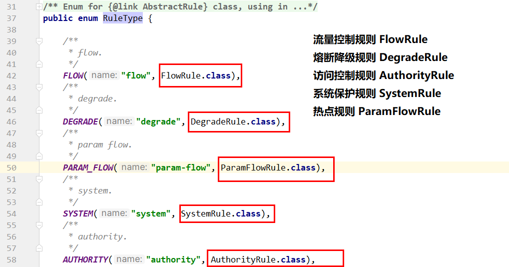

### OpenFeign 和 Sentinel集成实现fallback服务降级

#### 服务提供者

1. 引入pom

   ```xml
    <!--openfeign-->
           <dependency>
               <groupId>org.springframework.cloud</groupId>
               <artifactId>spring-cloud-starter-openfeign</artifactId>
           </dependency>
           <!--alibaba-sentinel-->
           <dependency>
               <groupId>com.alibaba.cloud</groupId>
               <artifactId>spring-cloud-starter-alibaba-sentinel</artifactId>
           </dependency>
   ```

2. 编写代码

   ```java
   @RestController
   public class PayAlibabaController
   {
       @GetMapping("/pay/nacos/get/{orderNo}")
       @SentinelResource(value = "getPayByOrderNo",blockHandler = "handlerBlockHandler")
       public ResultData getPayByOrderNo(@PathVariable("orderNo") String orderNo)
       {
           //模拟从数据库查询出数据并赋值给DTO
           PayDTO payDTO = new PayDTO();
   
           payDTO.setId(1024);
           payDTO.setOrderNo(orderNo);
           payDTO.setAmount(BigDecimal.valueOf(9.9));
           payDTO.setPayNo("pay:"+IdUtil.fastUUID());
           payDTO.setUserId(1);
   
           return ResultData.success("查询返回值："+payDTO);
       }
       public ResultData handlerBlockHandler(@PathVariable("orderNo") String orderNo,BlockException exception)
       {
           return ResultData.fail(ReturnCodeEnum.RC500.getCode(),"getPayByOrderNo服务不可用，" +
                   "触发sentinel流控配置规则"+"\t"+"o(╥﹏╥)o");
       }
       /*
       fallback服务降级方法纳入到Feign接口统一处理，全局一个
       public ResultData myFallBack(@PathVariable("orderNo") String orderNo,Throwable throwable)
       {
           return ResultData.fail(ReturnCodeEnum.RC500.getCode(),"异常情况："+throwable.getMessage());
       }
       */
   }
   ```

#### Api接口

1. 引入pom

   ```xml
   <!--openfeign-->
           <dependency>
               <groupId>org.springframework.cloud</groupId>
               <artifactId>spring-cloud-starter-openfeign</artifactId>
           </dependency>
           <!--alibaba-sentinel-->
           <dependency>
               <groupId>com.alibaba.cloud</groupId>
               <artifactId>spring-cloud-starter-alibaba-sentinel</artifactId>
           </dependency>
   ```

2. 编写代码

   ```java
   @FeignClient(value = "nacos-payment-provider",fallback = PayFeignSentinelApiFallBack.class)
   public interface PayFeignSentinelApi
   {
       @GetMapping("/pay/nacos/get/{orderNo}")
       public ResultData getPayByOrderNo(@PathVariable("orderNo") String orderNo);
   }
   ```

   - 为远程调用新建全局统一服务降级类

     ```java
     @Component
     public class PayFeignSentinelApiFallBack implements PayFeignSentinelApi
     {
         @Override
         public ResultData getPayByOrderNo(String orderNo)
         {
             return ResultData.fail(ReturnCodeEnum.RC500.getCode(),"对方服务宕机或不可用，FallBack服务降级o(╥﹏╥)o");
         }
     }
     ```

### GateWay 和 Sentinel 集成实现服务限流

#### 引入pom

```xml
				<dependency>
            <groupId>org.springframework.cloud</groupId>
            <artifactId>spring-cloud-starter-gateway</artifactId>
        </dependency>
        <dependency>
            <groupId>com.alibaba.csp</groupId>
            <artifactId>sentinel-transport-simple-http</artifactId>
            <version>1.8.6</version>
        </dependency>
        <dependency>
            <groupId>com.alibaba.csp</groupId>
            <artifactId>sentinel-spring-cloud-gateway-adapter</artifactId>
            <version>1.8.6</version>
        </dependency>
        <dependency>
            <groupId>javax.annotation</groupId>
            <artifactId>javax.annotation-api</artifactId>
            <version>1.3.2</version>
            <scope>compile</scope>
        </dependency>
```

#### 改写yaml

```yaml
spring:
  application:
    name: cloudalibaba-sentinel-gateway     # sentinel+gataway整合Case
  cloud:
    nacos:
      discovery:
        server-addr: localhost:8848
    gateway:
      routes:
        - id: pay_routh1 #pay_routh1                #路由的ID(类似mysql主键ID)，没有固定规则但要求唯一，建议配合服务名
          uri: http://localhost:9001                #匹配后提供服务的路由地址
          predicates:
          - Path=/pay/**                      # 断言，路径相匹配的进行路由
```

#### 代码编写

参考官方文档：https://github.com/alibaba/Sentinel/wiki/%E7%BD%91%E5%85%B3%E9%99%90%E6%B5%81#spring-cloud-gateway

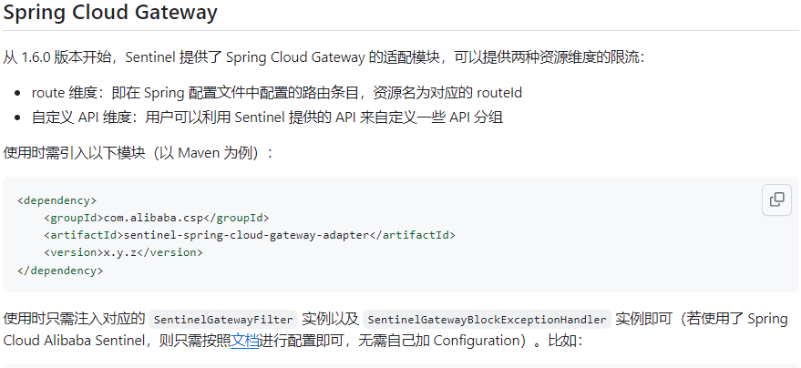

```java
/**
 * @auther zzyy
 * @create 2023-12-01 15:38
 * 使用时只需注入对应的 SentinelGatewayFilter 实例以及 SentinelGatewayBlockExceptionHandler 实例即可
 */
@Configuration
public class GatewayConfiguration {

    private final List<ViewResolver> viewResolvers;
    private final ServerCodecConfigurer serverCodecConfigurer;

    public GatewayConfiguration(ObjectProvider<List<ViewResolver>> viewResolversProvider, ServerCodecConfigurer serverCodecConfigurer)
    {
        this.viewResolvers = viewResolversProvider.getIfAvailable(Collections::emptyList);
        this.serverCodecConfigurer = serverCodecConfigurer;
    }

    @Bean
    @Order(Ordered.HIGHEST_PRECEDENCE)
    public SentinelGatewayBlockExceptionHandler sentinelGatewayBlockExceptionHandler() {
        // Register the block exception handler for Spring Cloud Gateway.
        return new SentinelGatewayBlockExceptionHandler(viewResolvers, serverCodecConfigurer);
    }

    @Bean
    @Order(-1)
    public GlobalFilter sentinelGatewayFilter() {
        return new SentinelGatewayFilter();
    }

    @PostConstruct //javax.annotation.PostConstruct
    public void doInit() {
        initBlockHandler();
    }


    //处理/自定义返回的例外信息
    private void initBlockHandler() {
        Set<GatewayFlowRule> rules = new HashSet<>();
        rules.add(new GatewayFlowRule("pay_routh1").setCount(2).setIntervalSec(1));

        GatewayRuleManager.loadRules(rules);
        BlockRequestHandler handler = new BlockRequestHandler() {
            @Override
            public Mono<ServerResponse> handleRequest(ServerWebExchange exchange, Throwable t) {
                Map<String,String> map = new HashMap<>();

                map.put("errorCode", HttpStatus.TOO_MANY_REQUESTS.getReasonPhrase());
                map.put("errorMessage", "请求太过频繁，系统忙不过来，触发限流(sentinel+gataway整合Case)");

                return ServerResponse.status(HttpStatus.TOO_MANY_REQUESTS)
                        .contentType(MediaType.APPLICATION_JSON)
                        .body(BodyInserters.fromValue(map));
            }
        };
        GatewayCallbackManager.setBlockHandler(handler);
    }

}
```


## 十二、Seata分布式事物

### 是什么？

- Seata 是一款开源的分布式事务解决方案，致力于提供高性能和简单易用的分布式事务服务。Seata 将为用户提供了 AT、TCC、SAGA 和 XA 事务模式，为用户打造一站式的分布式解决方案。 

  

### Seta术语

1. **TC (Transaction Coordinator) - 事务协调者**
   - 维护全局和分支事务的状态，驱动全局事务提交或回滚。
2. **TM (Transaction Manager) - 事务管理器**
   - 定义全局事务的范围：开始全局事务、提交或回滚全局事务。
3. **RM (Resource Manager) - 资源管理器**
   - 管理分支事务处理的资源，与TC交谈以注册分支事务和报告分支事务的状态，并驱动分支事务提交或回滚。

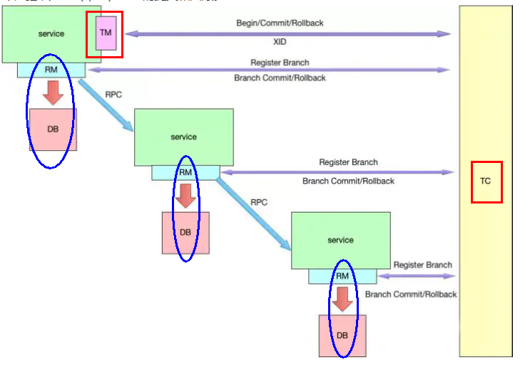

### 分布式事物执行流程

1. 三个组件相互协作，TC以Seata 服务器(Server)形式**独立部署**，TM和RM则是以Seata Client的形式集成在**微服务**中运行
2. 流程如下：
   1. TM 向 TC 申请开启一个全局事务，全局事务创建成功并生成一个全局唯一的 XID；
   2. XID 在微服务调用链路的上下文中传播；
   3. RM 向 TC 注册分支事务，将其纳入 XID 对应全局事务的管辖；
   4. TM 向 TC 发起针对 XID 的全局提交或回滚决议；
   5. TC 调度 XID 下管辖的全部分支事务完成提交或回滚请求。

### 安装使用

1. 下载地址：https://github.com/seata/seata/releases

2. 建库建表

   - 参考地址：https://github.com/apache/incubator-seata/blob/develop/script/server/db/mysql.sql

     ```mysql
     -- -------------------------------- The script used when storeMode is 'db' --------------------------------
     
     -- the table to store GlobalSession data
     
     CREATE TABLE IF NOT EXISTS `global_table`
     
     (
     
         `xid`                       VARCHAR(128) NOT NULL,
     
         `transaction_id`            BIGINT,
     
         `status`                    TINYINT      NOT NULL,
     
         `application_id`            VARCHAR(32),
     
         `transaction_service_group` VARCHAR(32),
     
         `transaction_name`          VARCHAR(128),
     
         `timeout`                   INT,
     
         `begin_time`                BIGINT,
     
         `application_data`          VARCHAR(2000),
     
         `gmt_create`                DATETIME,
     
         `gmt_modified`              DATETIME,
     
         PRIMARY KEY (`xid`),
     
         KEY `idx_status_gmt_modified` (`status` , `gmt_modified`),
     
         KEY `idx_transaction_id` (`transaction_id`)
     
     ) ENGINE = InnoDB
     
       DEFAULT CHARSET = utf8mb4;
     
     
     
     -- the table to store BranchSession data
     
     CREATE TABLE IF NOT EXISTS `branch_table`
     
     (
     
         `branch_id`         BIGINT       NOT NULL,
     
         `xid`               VARCHAR(128) NOT NULL,
     
         `transaction_id`    BIGINT,
     
         `resource_group_id` VARCHAR(32),
     
         `resource_id`       VARCHAR(256),
     
         `branch_type`       VARCHAR(8),
     
         `status`            TINYINT,
     
         `client_id`         VARCHAR(64),
     
         `application_data`  VARCHAR(2000),
     
         `gmt_create`        DATETIME(6),
     
         `gmt_modified`      DATETIME(6),
     
         PRIMARY KEY (`branch_id`),
     
         KEY `idx_xid` (`xid`)
     
     ) ENGINE = InnoDB
     
       DEFAULT CHARSET = utf8mb4;
     
     
     
     -- the table to store lock data
     
     CREATE TABLE IF NOT EXISTS `lock_table`
     
     (
     
         `row_key`        VARCHAR(128) NOT NULL,
     
         `xid`            VARCHAR(128),
     
         `transaction_id` BIGINT,
     
         `branch_id`      BIGINT       NOT NULL,
     
         `resource_id`    VARCHAR(256),
     
         `table_name`     VARCHAR(32),
     
         `pk`             VARCHAR(36),
     
         `status`         TINYINT      NOT NULL DEFAULT '0' COMMENT '0:locked ,1:rollbacking',
     
         `gmt_create`     DATETIME,
     
         `gmt_modified`   DATETIME,
     
         PRIMARY KEY (`row_key`),
     
         KEY `idx_status` (`status`),
     
         KEY `idx_branch_id` (`branch_id`),
     
         KEY `idx_xid` (`xid`)
     
     ) ENGINE = InnoDB
     
       DEFAULT CHARSET = utf8mb4;
     
     
     
     CREATE TABLE IF NOT EXISTS `distributed_lock`
     
     (
     
         `lock_key`       CHAR(20) NOT NULL,
     
         `lock_value`     VARCHAR(20) NOT NULL,
     
         `expire`         BIGINT,
     
         primary key (`lock_key`)
     
     ) ENGINE = InnoDB
     
       DEFAULT CHARSET = utf8mb4;
     
     
     
     INSERT INTO `distributed_lock` (lock_key, lock_value, expire) VALUES ('AsyncCommitting', ' ', 0);
     
     INSERT INTO `distributed_lock` (lock_key, lock_value, expire) VALUES ('RetryCommitting', ' ', 0);
     
     INSERT INTO `distributed_lock` (lock_key, lock_value, expire) VALUES ('RetryRollbacking', ' ', 0);
     
     INSERT INTO `distributed_lock` (lock_key, lock_value, expire) VALUES ('TxTimeoutCheck', ' ', 0);
     ```

3. 修改yaml

   ```yaml
   #  Copyright 1999-2019 Seata.io Group.
   
   #
   
   #  Licensed under the Apache License, Version 2.0 (the "License");
   
   #  you may not use this file except in compliance with the License.
   
   #  You may obtain a copy of the License at
   
   #
   
   #  http://www.apache.org/licenses/LICENSE-2.0
   
   #
   
   #  Unless required by applicable law or agreed to in writing, software
   
   #  distributed under the License is distributed on an "AS IS" BASIS,
   
   #  WITHOUT WARRANTIES OR CONDITIONS OF ANY KIND, either express or implied.
   
   #  See the License for the specific language governing permissions and
   
   #  limitations under the License.
   
    
   
   server:
   
     port: 7091
   
    
   
   spring:
   
     application:
   
       name: seata-server
   
    
   
   logging:
   
     config: classpath:logback-spring.xml
   
     file:
   
       path: ${log.home:${user.home}/logs/seata}
   
     extend:
   
       logstash-appender:
   
         destination: 127.0.0.1:4560
   
       kafka-appender:
   
         bootstrap-servers: 127.0.0.1:9092
   
         topic: logback_to_logstash
   
    
   
   console:
   
     user:
   
       username: seata
   
       password: seata
   
    
   
    
   
   seata:
   
     config:
   
       type: nacos
   
       nacos:
   
         server-addr: 127.0.0.1:8848
   
         namespace:
   
         group: SEATA_GROUP #后续自己在nacos里面新建,不想新建SEATA_GROUP，就写DEFAULT_GROUP
   
         username: nacos
   
         password: nacos
   
     registry:
   
       type: nacos
   
       nacos:
   
         application: seata-server
   
         server-addr: 127.0.0.1:8848
   
         group: SEATA_GROUP #后续自己在nacos里面新建,不想新建SEATA_GROUP，就写DEFAULT_GROUP
   
         namespace:
   
         cluster: default
   
         username: nacos
   
         password: nacos    
   
     store:
   
       mode: db
   
       db:
   
         datasource: druid
   
         db-type: mysql
   
         driver-class-name: com.mysql.cj.jdbc.Driver
   
         url: jdbc:mysql://localhost:3306/seata?characterEncoding=utf8&useSSL=false&serverTimezone=GMT%2B8&rewriteBatchedStatements=true&allowPublicKeyRetrieval=true
   
         user: root
   
         password: 123456
   
         min-conn: 10
   
         max-conn: 100
   
         global-table: global_table
   
         branch-table: branch_table
   
         lock-table: lock_table
   
         distributed-lock-table: distributed_lock
   
         query-limit: 1000
   
         max-wait: 5000
   
    
   
    
   
    
   
     #  server:
   
     #    service-port: 8091 #If not configured, the default is '${server.port} + 1000'
   
     security:
   
       secretKey: SeataSecretKey0c382ef121d778043159209298fd40bf3850a017
   
       tokenValidityInMilliseconds: 1800000
   
       ignore:
   
         urls: /,/**/*.css,/**/*.js,/**/*.html,/**/*.map,/**/*.svg,/**/*.png,/**/*.jpeg,/**/*.ico,/api/v1/auth/login,/metadata/v1/**
   ```

4. 添加`@GlobalTransactional()`注解

### Seata原理总结

1. 在一阶段，Seata 会拦截“业务 SQL”，

   - 解析 SQL 语义，找到“业务 SQL”要更新的业务数据，在业务数据被更新前，将其保存成“before image”，
   - 执行“业务 SQL”更新业务数据，在业务数据更新之后，
   - 其保存成“after image”，最后生成行锁。
   - 以上操作全部在一个数据库事务内完成，这样保证了一阶段操作的原子性。

   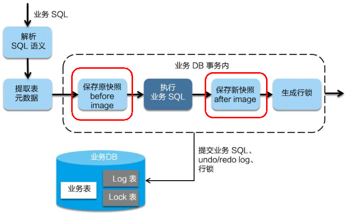

2. 二阶段如是顺利提交的话，

   - 因为“业务 SQL”在一阶段已经提交至数据库，所以Seata框架只需将一阶段保存的快照数据和行锁删掉，完成数据清理即可。

   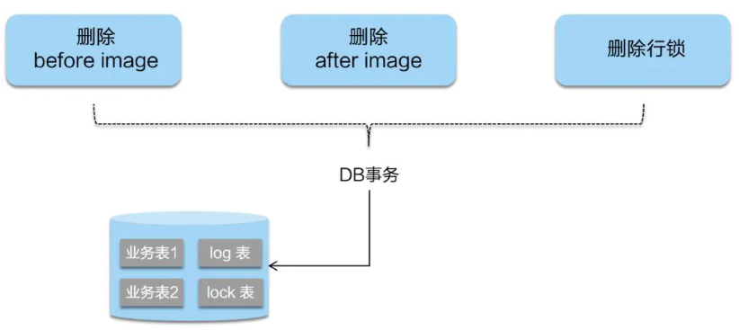

3. 二阶段回滚：

   - 二阶段如果是回滚的话，Seata 就需要回滚一阶段已经执行的“业务 SQL”，还原业务数据。
   - 回滚方式便是用“before image”还原业务数据；但在还原前要首先要校验脏写，对比“数据库当前业务数据”和 “after image”，
   - 如果两份数据完全一致就说明没有脏写，可以还原业务数据，如果不一致就说明有脏写，出现脏写就需要转人工处理。

​	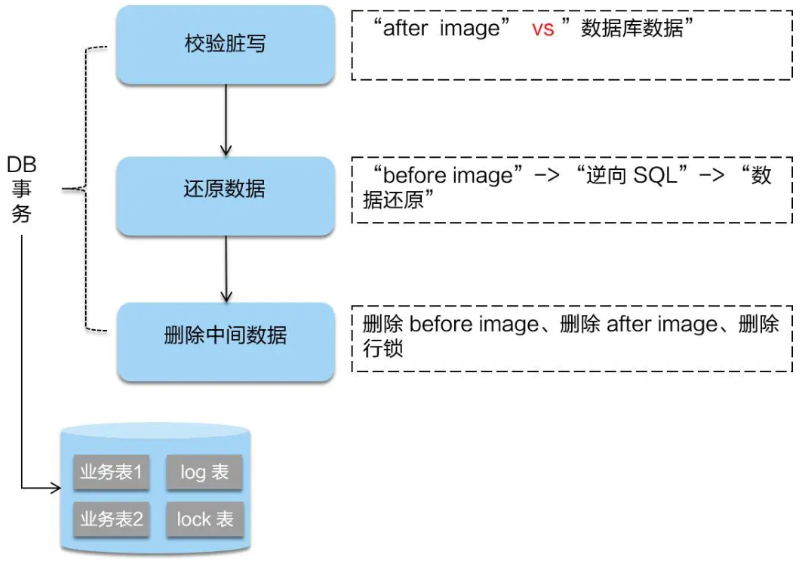


## 十三、构建项目步骤

1. 建module
2. 改pom
3. 写yml
4. 启动类